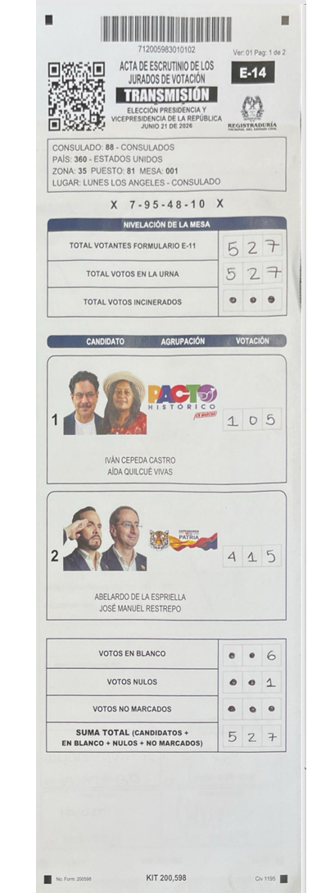
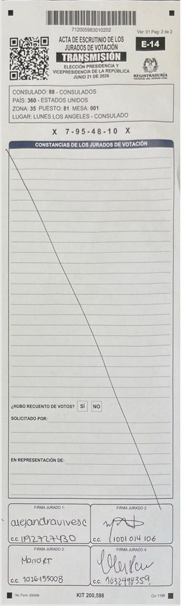

# MAPEO PERICIAL DE INYECCIÓN DE CAPAS: LOS ÁNGELES (1ª VUELTA - LUNES MESA 1)

**Acta Evaluada:** `81_LUNES_LOS_ANGELES_-_CONSULADO / mesa_001.pdf` (Primera Vuelta - Votación Adelantada).  
**Formato de Documento:** 3 Páginas (Multicandidato + Máscara Blanca).  

---

## 1. VINCULACIÓN VISUAL DE LAS 4 CAPAS EXTRAÍDAS DE LA MESA DE LUNES






```
+-----------------------------------------------------------------------------------+
| [CAPAS EXTRAÍDAS DE LUNES MESA 1 (LOS ÁNGELES)] | [MAPA DE OBJETOS SINTÁCTICOS PDF]|
+-------------------------------------------------+---------------------------------+
|                                                 |                                 |
|  1. CAPA PÁGINA 1: `capa_la_v1-000.png` (379 KB)|  +---------------------------+  |
|     - Planilla de Candidatos 1 a 4.             |  | /Page 1 (/Contents ID 5)  |  |
|                                                 |  +---------------------------+  |
|                                                 |                                 |
|  2. CAPA INYECCIÓN 1: `capa_la_v1-001.png`      |  +---------------------------+  |
|     - Matriz de Código QR superpuesta.          |  | 🚨 /XObject ID 6 0 R     |  |
|                                                 |  | [PARCHE QR INYECTADO]     |  |
|                                                 |  +---------------------------+  |
|                                                 |                                 |
|  3. CAPA PÁGINA 2: `capa_la_v1-002.png` (347 KB)|  +---------------------------+  |
|     - Planilla de Candidatos 5 a 8 y Totales.   |  | /Page 2 (/Contents ID 10) |  |
|                                                 |  +---------------------------+  |
|                                                 |                                 |
|  4. CAPA PÁGINA 3: `capa_la_v1-003.png`         |  +---------------------------+  |
|     - 🚨 MÁSCARA BLANCA / LIENZO BLANCO         |  | 🚨 /XObject ID 11 0 R    |  |
|       (Dimensiones idénticas 1260x3897 px).     |  | [MÁSCARA PÁGINA 3 BLANCA] |  |
|                                                 |  +---------------------------+  |
|                                                 |                                 |
|                                                 |  ⚠️ ADVERTENCIA QPDF XREF:      |
|                                                 |  reported 15 != highest 13      |
+-------------------------------------------------+---------------------------------+
```

---

## 2. ANÁLISIS PERICIAL DE LA ESTRUCTURA EN LUNES MESA 1 DE LOS ÁNGELES

1. **Inyección en Página 1 y 2 (`/XObject ID 6`):**
   * A diferencia de la 2ª Vuelta (donde las casillas están condensadas en una sola página de 612x1008 pt), la 1ª Vuelta extiende las candidaturas en el lienzo largo de `1260 x 3897 px`.
   * El objeto `/XObject ID 6 0 R` inyecta los elementos matriciales sobre la 1ª y 2ª página.

2. **La Máscara Blanca de la 3ª Página (`/XObject ID 11` / `capa_la_v1-003.png`):**
   * La 4ª capa extraída es una **imagen 100% en blanco de dimensión exacta 1260 x 3897 px**.
   * Esto confirma el mecanismo de **Sustitución de Página (*Page Substitution / Blind Masking*)**: el software inyectó un lienzo blanco para suprimir o reemplazar la 3ª página de conteo de votos en la mesa de Lunes de Los Ángeles.
