```mermaid
graph TD
    A["👑 INICIO DE INVESTIGACIÓN FORENSE (31 Mayo - 01 Junio 2026)"] --> B["Fase 1: Anomalía de Los Ángeles & Benford 2BL"]
    B --> C1["🔬 Rama Técnica: MAPEO_INYECCION_LOS_ANGELES_1RA_VUELTA.md"]
    B --> C2["⚖️ Rama Legal: ESTUDIO_ESTADISTICO_ANOMALIAS_CONSULADOS.md"]
    B --> C3["🗣️ Rama Ciudadana: Resumen Votos Clónicos =REDONDEAR"]

    A --> D["Fase 2: Asedio, Bloqueo de Red & Rescate SHA-256 (08 - 21 Junio)"]
    D --> E1["🔬 Rama Técnica: REPORTE_FORENSE_BLOQUEO_ACCESO_DATOS.md"]
    D --> E2["⚖️ Rama Legal: INFORME_INTEGRIDAD_SHA256.md & Hashes"]
    D --> E3["🗣️ Rama Ciudadana: LINEA_DE_TIEMPO_INCIDENTES_Y_ATAQUES.md"]

    A --> F["Fase 3: Cicatrices XREF & Cobertura CIDH (06 Julio - 07 Agosto)"]
    F --> G1["🔬 Rama Técnica: REPORTE_MASIVO_DEEPFAKES.md (57.9k PDFs XREF)"]
    F --> G2["⚖️ Rama Legal: ACTA_DE_HALLAZGOS_FORENSES_MATRIZ_14_PUNTOS.md"]
    F --> G3["🗣️ Rama Ciudadana: siguiendo_la_anomalia.md"]

    A --> H["Fase 4: Consolidación Acervo >677 GB & Suite Local (22 - 31 Agosto)"]
    H --> I1["🔬 Rama Técnica: INFORME_CONSOLIDADO_ACERVO_677GB.md & Modelfile"]
    H --> I2["⚖️ Rama Legal: MEMORIA_PERMANENTE_NARRATIVA_CHRONICLE.md"]
    H --> I3["🗣️ Rama Ciudadana: PWA App & Simulador Ciber-Táctico"]
```

# 🗺️ MAPA MAESTRO DE BIFURCACIONES Y CRONOLOGÍA DE INFORMES FORENSES
## BabaYaga Core — Clasificación Total por Fechas, Hallazgos y Audiencias
### Director & Head of Research: Andrea Zabala Cárcamo (AnZaCa)

> **Regla Rectoral de Actualización:** Todo hallazgo técnico en la rama pericial debe desglosarse en sesiones navegables para tres públicos objetivos:
> 1) **Técnico/Pericial** (Estadística, XREF, Spoofing, Firmware)
> 2) **Legal/Jurídico** (CIDH, Cortes, Cadena de Custodia SHA-256)
> 3) **Ciudadano Común** (Guías didácticas, mapas y explicaciones sencillas)

---

---

## 📅 DESGLOSE CRONOLÓGICO Y MATRIZ DE RUTA

### 🔴 FASE 1: Detección Inicial de Anomalía (31 Mayo - 3 Junio 2026)
* **🔬 Técnico/Pericial:**
  * [`MAPEO_INYECCION_LOS_ANGELES_1RA_VUELTA.md`](file:///home/andrea-zabala-c/AndreTaker---AnZaCa-Rep/02_ANALISIS/MAPEO_INYECCION_LOS_ANGELES_1RA_VUELTA.md) — Demostración de votos clónicos en Mesas 001-013 (`Z = -56.96`).
  * [`muestra_mesas_benford_nacional.md`](file:///home/andrea-zabala-c/AndreTaker---AnZaCa-Rep/02_ANALISIS/muestra_mesas_benford_nacional.md) — Muestreo de 451 mesas idénticas con 161 votos fijos.
* **⚖️ Legal/Jurídico:**
  * [`ESTUDIO_ESTADISTICO_ANOMALIAS_CONSULADOS.md`](file:///home/andrea-zabala-c/AndreTaker---AnZaCa-Rep/02_ANALISIS/ESTUDIO_ESTADISTICO_ANOMALIAS_CONSULADOS.md) — Dictamen inicial notificado formalmente.
  * [`informe_forense_estados_unidos.md`](file:///home/andrea-zabala-c/AndreTaker---AnZaCa-Rep/02_ANALISIS/informe_forense_estados_unidos.md) — Peritaje de votación exterior.
* **🗣️ Ciudadano Común:**
  * Explicación didáctica de la disonancia en el segundo dígito y el algoritmo `=REDONDEAR(total * 0.70)`.

---

### 🟠 FASE 2: Asedio, Bloqueo de Red & Rescate SHA-256 (8 - 21 Junio 2026)
* **🔬 Técnico/Pericial:**
  * [`REPORTE_FORENSE_BLOQUEO_ACCESO_DATOS.md`](file:///home/andrea-zabala-c/AndreTaker---AnZaCa-Rep/02_ANALISIS/REPORTE_FORENSE_BLOQUEO_ACCESO_DATOS.md) — Telemetría del geobloqueo de IP/MAC por la Registraduría.
  * [`HASHES_PRIMERA_VUELTA.md`](file:///home/andrea-zabala-c/AndreTaker---AnZaCa-Rep/02_ANALISIS/HASHES_PRIMERA_VUELTA.md) — Firmas de los primeros 117.993 PDFs extraídos.
* **⚖️ Legal/Jurídico:**
  * [`INFORME_INTEGRIDAD_SHA256.md`](file:///home/andrea-zabala-c/AndreTaker---AnZaCa-Rep/02_ANALISIS/INFORME_INTEGRIDAD_SHA256.md) — Garantía de inmutabilidad y cadena de custodia ISO 27037.
  * Correo enviado a la Fiscalía y Registraduría estableciendo la firma SHA-256 reservada para Juez.
* **🗣️ Ciudadano Común:**
  * [`LINEA_DE_TIEMPO_INCIDENTES_Y_ATAQUES.md`](file:///home/andrea-zabala-c/AndreTaker---AnZaCa-Rep/02_ANALISIS/LINEA_DE_TIEMPO_INCIDENTES_Y_ATAQUES.md) — Cronología del rescate por 75,000 Testigos Digitales y la llamada 911 de Arthurios.

---

### 🟡 FASE 3: Cicatrices XREF & Cobertura Internacional CIDH (6 Julio - 7 Agosto 2026)
* **🔬 Técnico/Pericial:**
  * [`REPORTE_MASIVO_DEEPFAKES.md`](file:///home/andrea-zabala-c/AndreTaker---AnZaCa-Rep/02_ANALISIS/REPORTE_MASIVO_DEEPFAKES.md) — Diagnóstico de 57,981 PDFs con descalce XREF (`15 declared != 13 highest`).
  * [`RESULTADOS_MUESTRAS_LUZ_DEEPFAKE.md`](file:///home/andrea-zabala-c/AndreTaker---AnZaCa-Rep/02_ANALISIS/RESULTADOS_MUESTREO_LUZ_DEEPFAKE.md) — Varianza nula en máscaras sintéticas 1bpc ($\sigma=0.0$).
* **⚖️ Legal/Jurídico:**
  * [`ACTA_DE_HALLAZGOS_FORENSES_MATRIZ_14_PUNTOS.md`](file:///home/andrea-zabala-c/AndreTaker---AnZaCa-Rep/02_ANALISIS/ACTA_DE_HALLAZGOS_FORENSES_MATRIZ_14_PUNTOS.md) — Expediente completo bajo radicado CIDH `IACHR-0000113728`.
  * [`DICTAMEN_PERICIAL_FORENSE_FINAL.md`](file:///home/andrea-zabala-c/AndreTaker---AnZaCa-Rep/02_ANALISIS/DICTAMEN_PERICIAL_FORENSE_FINAL.md) — Dictamen jurídico-técnico consolidado.
* **🗣️ Ciudadano Común:**
  * [`siguiendo_la_anomalia.md`](file:///home/andrea-zabala-c/AndreTaker---AnZaCa-Rep/03_DOCUMENTACION/siguiendo_la_anomalia.md) — Relato cronológico desde la salida de México hasta el arribo al Aeropuerto YUL en Canadá.

---

### 🟢 FASE 4: Consolidación de Acervo >677 GB & Suite Local AndreTaker (22 - 31 Agosto 2026)
* **🔬 Técnico/Pericial:**
  * [`INFORME_CONSOLIDADO_ACERVO_677GB.md`](file:///home/andrea-zabala-c/AndreTaker---AnZaCa-Rep/03_DOCUMENTACION/INFORME_CONSOLIDADO_ACERVO_677GB.md) — Auditoría de >677 GB y 121,960 PDFs.
  * [`BABAYAGA_CORE/SYSTEM_INSTRUCTIONS_GEMINI_AI_STUDIO.md`](file:///home/andrea-zabala-c/AndreTaker---AnZaCa-Rep/BABAYAGA_CORE/SYSTEM_INSTRUCTIONS_GEMINI_AI_STUDIO.md) & [`Modelfile`](file:///home/andrea-zabala-c/AndreTaker---AnZaCa-Rep/BABAYAGA_CORE/Modelfile).
  * Protocolos de defensa: Anti-Pegasus, SS7, Anti-UI Overlay Locking & Blind Masking Technique.
* **⚖️ Legal/Jurídico:**
  * [`MEMORIA_PERMANENTE_NARRATIVA_CHRONICLE.md`](file:///home/andrea-zabala-c/AndreTaker---AnZaCa-Rep/BABAYAGA_CORE/MEMORIA_PERMANENTE_NARRATIVA_CHRONICLE.md) — Manifiesto inmutable de la Tríada (AndreTaker, Kepler, Tycho).
* **🗣️ Ciudadano Común:**
  * Portal Web Standalone (PWA) e Interactivo en Vivo: `index.html` con Simulador Ciber-Táctico y probador de voces de la banda sonora oficial.

================================================================================
