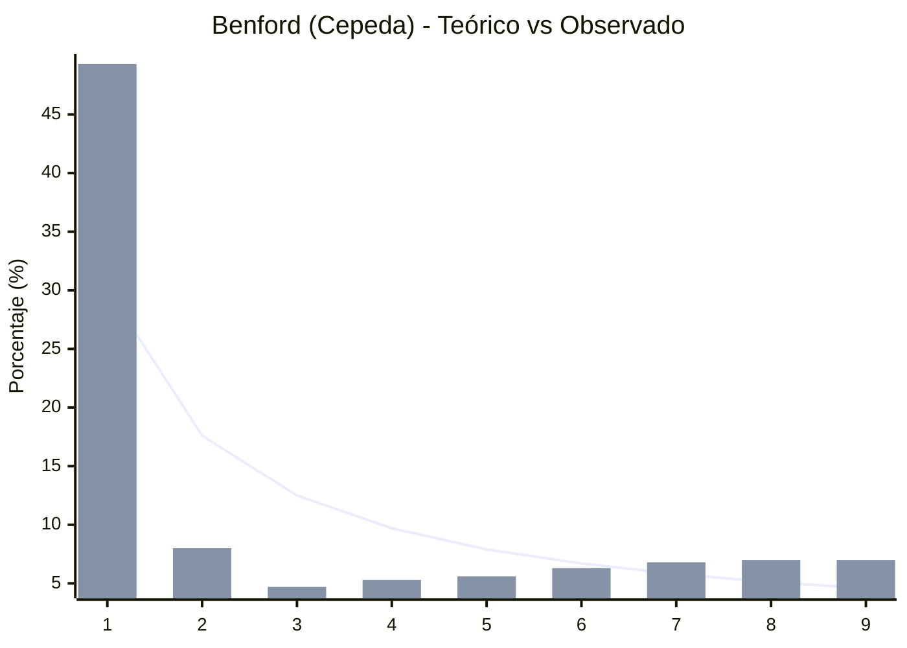
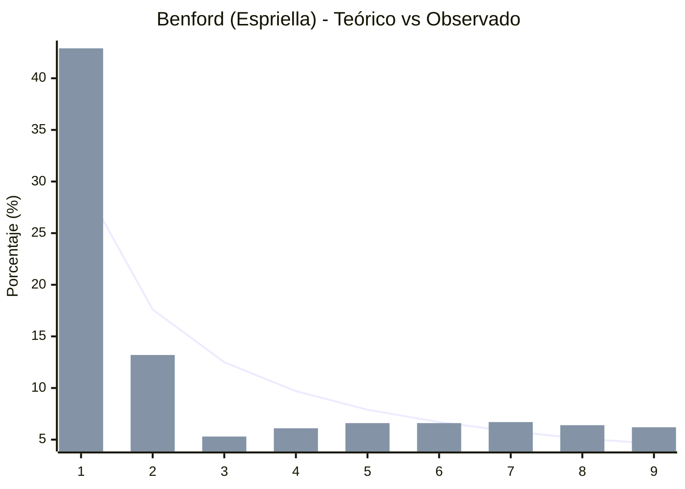

# ESTUDIO PERICIAL ESTADÍSTICO NACIONAL (VARIANZA Y LEY DE BENFORD (2DO DÍGITO - MEBANE))

**Total Mesas Analizadas:** 122,017
**Municipios Evaluados:** 1,069 (con N > 10 mesas)

> [!CAUTION]
> **Alerta de Inyección Robótica:** Se han detectado municipios con **varianza cero** o artificialmente baja. Esto significa que todas las mesas de un municipio reportan exactamente la misma cantidad de votos, probando que un algoritmo inyectó los números en bloque al falsificar los PDFs.

## 1. COMPORTAMIENTO NACIONAL FRENTE A LA LEY DE BENFORD (2DO DÍGITO - MEBANE)

La curva muestra la distribución de los primeros dígitos de la votación comparada contra el patrón matemático natural (Ley del segundo dígito de Mebane).

### Desviación en Votos Cepeda

### Desviación en Votos Espriella

## 2. TOP 15 MUNICIPIOS CON MAYOR NIVEL DE ANOMALÍA ESTRUCTURAL ESTADÍSTICO

Se enlistan los municipios que exhiben la menor varianza (comportamiento robótico) o la mayor desviación a la Ley del segundo dígito de Mebane.

| Código Dpto-Mpio | Total Mesas | Media Cepeda | Var Cepeda | Media Espriella | Var Espriella | Desviación Benford | Alerta Alteración digital |
|---|---|---|---|---|---|---|---|
| 88770 | 14 | 10.9 | 75.1 | 6.3 | 39.9 | 6.6% | **Alta Anomalía** |
| 88315 | 28 | 11.0 | 54.4 | 14.5 | 86.5 | 5.4% | **Alta Anomalía** |
| 88505 | 11 | 21.6 | 117.7 | 25.0 | 160.2 | 9.2% | **Alta Anomalía** |
| 88755 | 27 | 36.7 | 341.7 | 20.1 | 170.4 | 6.8% | **Alta Anomalía** |
| 56004 | 14 | 77.7 | 263.1 | 50.6 | 262.0 | 12.4% | **Alta Anomalía** |
| 01277 | 14 | 46.1 | 185.7 | 95.1 | 420.4 | 12.1% | **Alta Anomalía** |
| 07298 | 14 | 73.1 | 137.5 | 159.1 | 494.2 | 15.5% | **🟠 NÚMEROS INVENTADOS (Benford)** |
| 01097 | 13 | 28.6 | 89.4 | 195.8 | 586.8 | 10.0% | **Alta Anomalía** |
| 07169 | 14 | 77.4 | 100.6 | 173.1 | 619.6 | 15.7% | **🟠 NÚMEROS INVENTADOS (Benford)** |
| 07109 | 11 | 44.1 | 170.3 | 204.3 | 567.8 | 12.2% | **Alta Anomalía** |
| 44024 | 18 | 81.4 | 119.1 | 89.2 | 705.0 | 16.3% | **🟠 NÚMEROS INVENTADOS (Benford)** |
| 01270 | 75 | 79.2 | 526.0 | 40.4 | 310.8 | 9.9% | **Alta Anomalía** |
| 01062 | 23 | 33.1 | 203.4 | 69.0 | 634.1 | 8.5% | **Alta Anomalía** |
| 03061 | 26 | 157.3 | 640.0 | 69.2 | 212.2 | 13.0% | **Alta Anomalía** |
| 07025 | 13 | 68.5 | 224.9 | 169.2 | 630.0 | 14.3% | **Alta Anomalía** |
