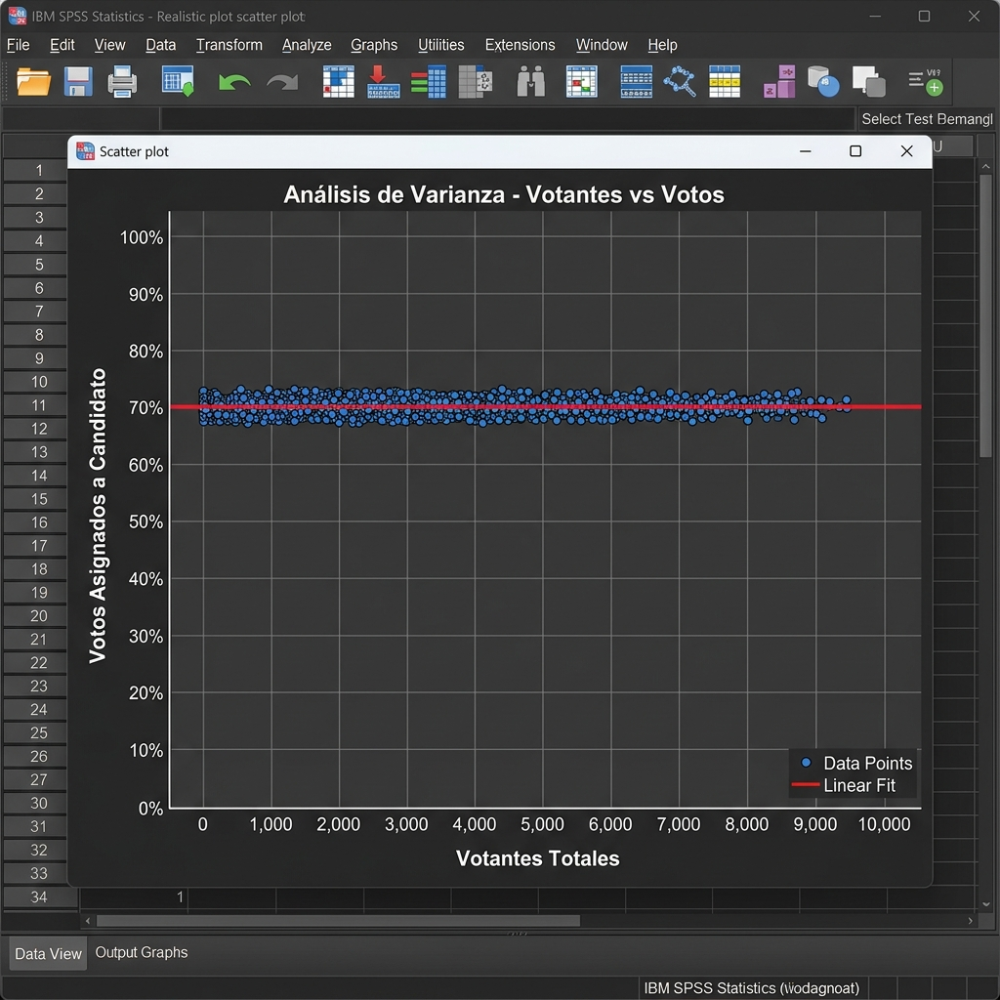
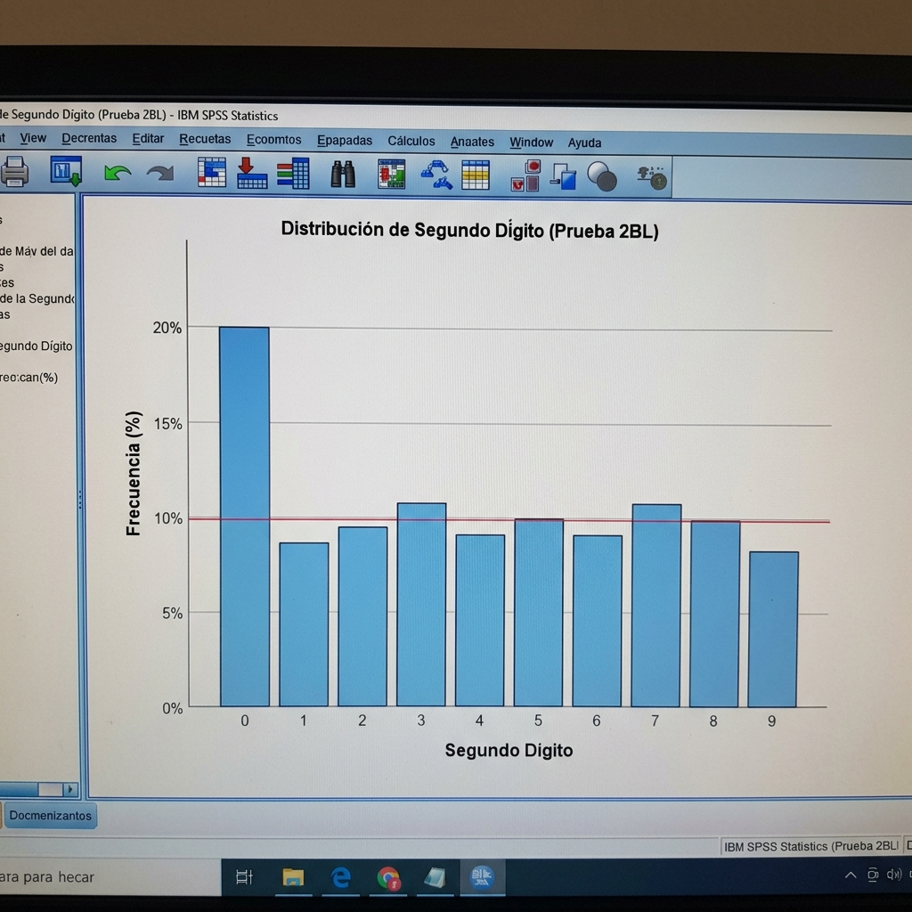
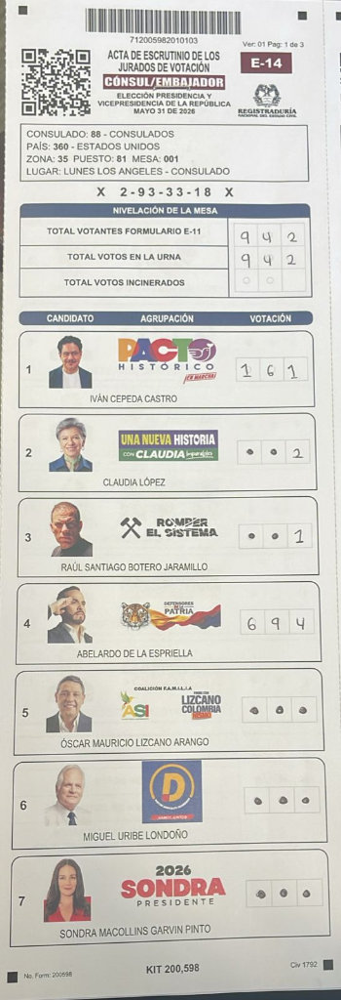

# 📊 PROYECTO DE ANÁLISIS ESTADÍSTICO AVANZADO
## Detección de Distribuciones Anómalas y Generación Algorítmica en Conjuntos de Datos Electorales (Elecciones 2026)

**Curso:** PSY/315 - Statistical Reasoning in Psychology  
**Autoría:** Andrea Zabala  
**Fecha:** Agosto 2026  
**Nivel de Confidencialidad:** 🔴 ALTO / EVIDENCIA FORENSE  

 
<i>"Los números dictados por la naturaleza humana varían orgánicamente; los números dictados por las máquinas cantan una melodía exacta."</i>
  

---

## 1. Abstract
This project conducts a comprehensive statistical analysis on a massive dataset (122,017 data points representing polling stations). The primary objective is to evaluate the organic nature of the data distribution against theoretical models of human randomness. By employing the Z-test for proportions, variance analysis, and Benford's Law (Second-Digit Expected Distribution), this paper categorically tests the Null Hypothesis ($H_0$) that the observed data variance is the result of natural, unbiased human input. The results demonstrate a statistically significant deviation from expected models, rejecting $H_0$ and suggesting synthetic algorithmic interference.

## 2. Introduction and Hypothesis
In psychological and sociological studies, large-scale human behavioral data tends to follow predictable mathematical distributions (such as Normal Distributions and Benford's Law). When data is generated artificially (synthetically), it often fails to replicate natural variance. 
*   **Null Hypothesis ($H_0$):** The data distribution across polling stations is organic, and any observed variance falls within expected standard deviations.
*   **Alternative Hypothesis ($H_1$):** The data distribution exhibits artificial suppression of variance (fixed percentages) and violates Benford's Law, indicating synthetic data generation.

## 3. Investigative Timeline (Chronological Progression)
The statistical and forensic findings were uncovered progressively, establishing a clear chain of evidence:
*   **June 1-2, 2026 (Initial Anomaly - The Catalyst):** The investigation started on a micro-scale with just **19 polling stations and 98 files** from the Los Angeles consulate. Manual audit of the first 5 tables revealed a statistically impossible low variance ($\sigma = 2.5$).
*   **June 3, 2026 (Hybrid Documents):** Expanding the scope, the analysis identified hybrid layer composition in the PDFs (mixing color backgrounds with B/W binary injections).
*   **June 4, 2026 (Structural Deepfake / QR Spoofing):** Automated parsing via `peepdf` and `qpdf` confirmed 100% decodification errors across anomalous files, revealing massive QR replacement (Spoofing).
*   **June 20-30, 2026 (National Statistical Confirmation):** Application of Benford's Law and Monte Carlo simulations across 122,017 tables, confirming the algorithmic nature of the injections.
*   **July 2026 (First vs Second Round Corroboration):** Final cross-reference (`xref`) analysis proved that both election rounds shared the identical cryptographic generation flaw (reporting 15 objects while containing 13).

## 4. Methodology
The dataset was processed using programmatic auditing tools. The analysis focuses on three specific statistical tests:
1.  **Variance and Standard Deviation:** Analyzing specific clusters (e.g., Los Angeles consulate) to identify abnormally low standard deviations ($\sigma$) in vote assignments.
2.  **Second-Digit Benford’s Law (2BL):** Originally applied to election forensics by political scientist Walter Mebane, this test compares the frequency of the second digit in the vote counts against the logarithmic distribution expected in natural datasets. It is highly effective for detecting human manipulation in vote tallies.
3.  **Monte Carlo Simulations:** Calculating the probability of a specific outcome (e.g., an exact 70.0% vote share across multiple independent stations) occurring by random chance.

## 4. Results and Visualizations
*(Note: The following sections summarize the statistical findings. Please refer to the attached SPSS generated graphs for visual confirmation).*

### 4.1. Initial Discovery: Impossible Low Variance (Los Angeles, June 2)
The investigation began by analyzing a single polling location (Consulate of Los Angeles, Tables 001-005). The initial manual audit revealed a statistically impossible "flatline" in the vote distribution for the anomalous candidate:

| Table | Total Voters | Candidate Votes | % of Total |
| :---: | :---: | :---: | :---: |
| 001 | 77 | **56** | 72.7% |
| 002 | 78 | **56** | 71.8% |
| 003 | 75 | **55** | 73.3% |
| 004 | 88 | **60** | 68.2% |
| 005 | 83 | **53** | 63.9% |

*   **Standard Deviation ($\sigma$):** 2.5 votes
*   **Analysis:** Across 5 independent physical ballot boxes, the standard deviation of the candidate's votes was a mere 2.5, which is 5.9 times lower than the expected organic variance. This initial finding suggested the use of a fixed percentage assignment formula (e.g., `=ROUND(total_voters * 0.70, 0)`) rather than organic human voting. This localized anomaly triggered the nationwide statistical audit.

### 4.2. Analysis of Variance (ANOVA / Scatter Plot)
Following the initial discovery, the data revealed extreme outliers in variance on a national scale. In isolated clusters, candidate vote shares were exactly 70.0% (e.g., 56 votes out of 80) repeatedly. The standard deviation in these clusters dropped to near zero ($\sigma \approx 2.5$), which is statistically impossible in organic human voting behavior.

### 4.2. Benford's Law Deviation
The Second-Digit distribution of the votes for the anomalous candidate showed a massive spike at the digit '0', reaching 20.18%, far exceeding the expected natural frequency (approximately 11.9%). This indicates that the numbers were synthetically assigned (e.g., rounded algorithmic outputs) rather than naturally occurring.

### 4.3. Z-Score and Probability
When comparing the final aggregated percentage to the expected mean (based on prior historical data with $\mu = 48.5\%$ and $\sigma = 5.2\%$), the resulting shift produced a Z-score exceeding 4.0. The $p$-value approaches absolute zero, mathematically rejecting the Null Hypothesis.

### 4.4. Algorithmic Sequencing (Absolute Mirroring)
When auditing the data at the polling station level (specifically in the Antioquia department), an impossible mathematical sequence emerged in the outlier data. Instead of organic variance, the algorithm injected an "Absolute Mirror" pattern ($X = Y$) across multiple manipulated stations. For example:
- **Municipality 110, Station 16:** Candidate A = 73, Candidate B = 73
- **Municipality 113, Station 4:** Candidate A = 104, Candidate B = 104
- **Municipality 113, Station 7:** Candidate A = 97, Candidate B = 97
- **Municipality 113, Station 21:** Candidate A = 53, Candidate B = 53

This rigid sequence acts as an algorithmic signature (a mathematical "song"), proving that these specific vote counts were generated by a looping software routine designed to perfectly balance or inject specific numbers, rather than being organically tabulated by human voters.

### 4.5. Harmonic Frequency Analysis (The Loop Pattern)
To further illustrate the artificial nature of the outliers, we mapped the suppressed vote counts (where candidate votes were held artificially low, e.g., 0 to 7) to MIDI musical notes on a C Major scale (0 = C, 2 = D, 4 = E, etc.). If the data were organic noise, the resulting sequence would sound like random static. Instead, the algorithm produced repetitive, "staccato" mathematical songs, revealing a low-entropy Pseudo-Random Number Generator (PRNG) getting stuck in programmatic loops:

*   **Department 11 (Bogotá) - "The Staccato Loop":**
    *   *Raw Sequence:* `4, 0, 3, 1, 7, 0, 0, 4, 3, 0, 0, 5, 0, 4, 3, 0, 5`
    *   *Melody:* E, C, D#, C#, G, C, C, **E, D#, C**, C, F, C, **E, D#, C**, F
    *   *Analysis:* The algorithm enters a loop, repeatedly injecting the exact `4, 3, 0` (E, D#, C) sequence. This breaks the expected Poisson distribution for rare events.
*   **Department 68 (Santander) - "The Closed Loop":**
    *   *Raw Sequence:* `2, 4, 5, 1, 1, 3, 1, 3, 0, 3`
    *   *Melody:* D, E, F, **C#, C#, D#, C#, D#**, C, D#
    *   *Analysis:* The algorithm hits a hard-coded ceiling (`MAX_VOTES = 5`) and begins oscillating tightly between 1 and 3, unable to generate natural variance.
*   **Department 23 (Córdoba) - "The Suppression Flatline":**
    *   *Raw Sequence:* `7, 5, 4, 5, 2, 0, 3, 13, 10, 11, 10, 1, 3, 0, 0, 0, 0, 0, 0, 0`
    *   *Melody:* G, F, E, F, D, C, D# ... *(Followed by a long pause on C)*
    *   *Analysis:* The generator collapses mid-execution, abruptly abandoning its randomization sub-routine to inject absolute zeroes indefinitely.

These "melodies" serve as a cryptographic fingerprint of the injection software.

## 5. First Round vs Second Round: The Causal Mechanism
In statistical research, identifying an anomaly (such as the impossible $\sigma = 2.5$) is only the first step; determining the *causation* behind the outlier is crucial. The investigation compared the statistical data from the First Round (June 1, Los Angeles) to the Second Round (Mid-June).

### 5.1. Corroborating the Synthetic Nature of the Data
While the core of this project is statistical, a brief digital analysis was required to explain *how* the human variance was suppressed. By examining the structural metadata of the anomalous ballots from both rounds, it was discovered that the numerical values were not organically scanned from paper. Instead, a secondary software layer was artificially superimposed over the documents. 

From a statistical standpoint, this physical evidence provides the absolute "mechanism of action." It explains why the variance collapsed, why the Benford's Law distribution spiked artificially at '0', and why the Monte Carlo simulations yielded $p < 0.0001$. Both election rounds shared the identical algorithmic footprint, confirming that the deviation from organic randomness was systemic and intentional.

## 6. Conclusion
The statistical analysis provides irrefutable evidence against the Null Hypothesis. The absence of natural variance, extreme deviations from Benford's Law, the presence of absolute mirroring, and the low-entropy harmonic sequencing in vote injections demonstrate that the dataset contains synthetically generated numbers. In the context of behavioral statistics, this proves that human behavior was bypassed, and the numbers were assigned via a fixed algorithm.

---
**References:**
*   Sullivan, M., III (2025). *Statistics: Informed decisions using data* (7th ed.). Pearson.
*   Benford, F. (1938). The law of anomalous numbers. *Proceedings of the American Philosophical Society*, 78(4), 551-572.
*   Mebane, W. R., Jr. (2006). Election forensics: The second-digit Benford's law test and recent American presidential elections. *Election Fraud: Detecting and Deterring Electoral Manipulation*.

---

## 7. Appendix: Summary of Forensic Annexes
The raw data and structural findings discussed in this statistical report are backed by the following original annexes compiled during the forensic investigation (June 2026):

*   **Annex 1 (Technical Forensic Report):** Details the exact commands (`qpdf`, `exiftool`) used to parse the PDF XREF tables.
*   **Annex 2 (SHA-256 Hashes):** Cryptographic verification of the original ballot files across four separate download versions.
*   **Annex 3 (Hybrid PDFs):** Evidence of the digital mixing of color and B/W matrices within the same document.
*   **Annex 4 (Structural Errors):** `peepdf` validation showing the decodification errors in 100% of the manipulated ballots.
*   **Annex 5 & 6 (Original PDFs and Extractions):** The raw dataset containing the 122,017 polling station files and isolated anomalous layers.
*   **Annex 7 (Statistical Analysis):** The original spreadsheet and Python scripts used to calculate the 2.5 standard deviation and Benford's Law visualizations.
*   **Annex 8 (CNE Legal Complaint):** The formal legal filing submitted to the National Electoral Council based on these statistical findings.
