# LÍNEA DE TIEMPO OFICIAL DE CIBERATAQUES, DENUNCIAS POLICIALES Y DERECHOS HUMANOS

**Especialista / Beneficiaria Principal:** Andrea Zabala Carcamo (C.C. 43.925.102)  
**Canales Activos de Contacto Seguro:** `anzaca0330@gmail.com` | `andrea.zabalacarcamo@email.phoenix.edu` (Demás cuentas inaccesibles por ciberataques)  
**Origen del Resguardo:** Red de Solidaridad de Testigos Digitales y Protección Diplomática en México.  
**Estatus CIDH:** Solicitud Formal de Medidas Cautelares ante la CIDH **`IACHR - 0000113728`** a nombre del núcleo familiar (Christopher Baez, Arturo Garcia Zabala y Andrea Zabala Carcamo).  
**Evidencia Clave Preservada:** Ticket/Key de Soporte Técnico Lenovo (**`Key Ref: [TICKET-LENOVO-REDACTED]`** - Bloqueo BIOS por Rootkit) + Respaldos Completos Google Takeout (~136 GB) + Archivo .vma del Sheriff.  
**Radicado Policial EE.UU.:** Buckingham County Sheriff's Office **`Incident C20260617-0024-01`**.  

10: ---
11: 
12: ## 🔑 MATRIZ DE CUENTAS COMPROMETIDAS (ARQUITECTURA DEL CIBERATAQUE)
13: 
14: Durante el asedio cibernético de 20 días, el vector de ataque se centró en interceptar, bloquear y rastrear la red de cuentas interconectadas utilizadas por la especialista:
15: 
16: | Cuenta | Rol en la Arquitectura | Estado Durante el Ataque |
17: |---|---|---|
18: | **`azabalabaez`** | **Cuenta Maestra / Administradora** | Comprometida. Controlaba los accesos de las demás cuentas. |
19: | **`andreazabalac`** | **Emisora Legal / Pública** | Interceptada. Cuenta con la que se emitieron las denuncias (CNE, Fiscalía). |
20: | **`ansekurt`** | **Cuenta Secundaria / Enlace** | Vulnerada y utilizada para triangulación de accesos. |
21: 
22: ---
23: 
24: ## 🧭 1. CRONOGRAMA GENERAL DE CIBERATAQUES Y PATRÓN SISTÉMICO DE PERSECUCIÓN

```mermaid
timeline
    title SECUENCIA CRONOLÓGICA CERTIFICADA Y CONTEXTO INSTITUCIONAL
    2023           : Informes y Denuncias Iniciales (Evolución de Evasión)
                   : Presentación de informes técnicos de fraude a grupos de control. Estas denuncias tempranas no detuvieron el fraude, sino que provocaron una "evolución técnica de evasión" en los perpetradores (transición de "Blind Masking" vectorial a "1-Bit Flattening" / Planchado Raster) para evadir las auditorías.
    3-4 Junio 2026 : Descubrimiento Forense de Alteración XREF en Actas E-14 (Páginas Blancas)
                   : Identificación técnica de anomalías estructurales en PDF ("number of objects 21, highest object number 19"). Prueba certificada mediante capturas del navegador Opera y análisis de IA (DeepSeek), demostrando edición incremental y spoofing antes del inicio de los ataques masivos.
                   : Metodología de detección de "1-Bit Flattening" (Planchado Raster) documentada mediante script Bash utilizando ImageMagick (`identify -format "%[colorspace]"`) para separar automatizadamente actas genuinas de máscaras de 1-bit falsificadas.
    8 Junio 2026   : Colapso de Red y Bloqueo de Tráfico E-14
                   : Durante la mañana, al conectar su celular (que se encontraba limpio) a la red WiFi, se produjo una caída total y externa del internet (Ataque de Denegación de Servicio Dirigido), impidiendo el acceso a la página de la Registraduría Nacional. Horas después, se materializa la infección por Rootkit (BIOS Lenovo bloqueado, Ticket Key Ref: [TICKET-LENOVO-REDACTED]).
    10 Junio 2026  : T-Mobile, Propagación del Rootkit a Terceros y Borrado Remoto
                   : Pérdida de cuenta de rescate y adquisición de nuevo equipo en T-Mobile. Al visitar la casa de sus suegros, el dispositivo ejecuta un borrado remoto de archivos en vivo (medida anti-forense presenciada visualmente). El Rootkit se propaga lateralmente e infecta también los dispositivos de los suegros.
    13 Junio 2026  : Sabotaje FIXD, SMS Payload (C2) y Emboscada Física/Digital
                   : En la tarde/noche (1:34 PM a 6:13 PM) el celular recibe ráfagas de mensajes SMS de "encuesta" (Short code 1003). Al estar el equipo y las redes previamente vulneradas, estos SMS funcionaron como un disparador (Command & Control).
                   : En la noche, tras salir de la casa de sus suegros y detenerse en una tienda (pagando con Google Wallet, transmitiendo su geolocalización exacta), ocurre el sabotaje físico al vehículo: Limp mode provocado remotamente vía vector OBD-II FIXD, forzando la detención.
                   : A las 11:01 PM ocurre la emboscada física por mujer afrodescendiente fingiendo auxilio y acusando falsamente intento de atropello (montaje). Su hijo llama al 911 (escuchado en vivo por su esposo en Dillwyn). Registro oficial T-Mobile: 3:00 min; Audio oficial del Sheriff entregado: `.wav` de 2:01 min con anomalías acústicas severas (Spoofing/Voz ininteligible y sin voz del operador).
    13-14 Junio 2026 (Madrugada): Escape por Sabotaje (Olor a Gas), Detección PEAP y Bloqueo Táctico
                   : Tras la emboscada, el vehículo presenta un fuerte olor a gas. La especialista y su hijo se ven forzados a salir del auto y refugiarse a la intemperie (afuera) en las escaleras de una iglesia lejana, con las luces de emergencia encendidas, esperando a la policía (la cual nunca arribó).
                   : Utilizando la Chromebook del menor, detecta en vivo que el FIXD conectado al vehículo emitía un puente hacia una red corporativa `PEAP`. Los atacantes comenzaron a borrar en vivo lo que ella escribía. A las 4:30 AM, siendo rápida con el teclado, logra realizar una maniobra de engaño (Spoofing defensivo): levanta una red WiFi con el nombre de una red cercana y asocia la MAC Address para romper la intrusión. 
                   : Posteriormente, elimina manualmente todas las conexiones Bluetooth del sistema del auto para purgar el enlace, extrae el dispositivo FIXD, lo esconde junto con los rastreadores (Tags) y la Chromebook en el sótano de la iglesia para cortar el rastreo físico, y huyen en el vehículo hasta estacionarse frente a la reserva del US ARMY en Charlottesville.
    15-19 Junio 2026: Aislamiento Total, Apagón Celular y Comportamiento Autónomo (Bootkit)
                   : A partir del 15 de junio (8:49 AM) hasta el 19 de junio (12:55 PM), los registros forenses de T-Mobile demuestran un apagón absoluto (cero SMS/llamadas). Durante esta semana de aislamiento, los dispositivos encendían sus conexiones Bluetooth de forma autónoma.
                   : Al intentar ejecutar un reinicio de fábrica (Factory Reset) en este dispositivo, la especialista evidenció que la pantalla de "Download Mode" (Modo de Descarga) era de color ROJO en lugar del azul estándar. Esta es la prueba técnica definitiva de un Bootloader comprometido (Custom ROM / Firmware modificado a bajo nivel). Ante la transmisión autónoma, el dispositivo fue arrojado lejos de la propiedad para romper el vector de rastreo. Posteriormente fue recuperado en secreto y puesto en cuarentena inmediata: forrado en papel aluminio (Jaula de Faraday casera), manteniéndose hoy preservado como evidencia material innegable.
    20 Junio 2026  : Inspección Técnica de Vehículo en Taller Especializado Mitsubishi
                   : Traslado del automóvil al concesionario/taller especializado Mitsubishi para revisión de sistemas eléctricos y escaneo del vector OBD-II (FIXD) tras el sabotaje del 13 de junio.
    Pos-20 Junio 2026: Llamada a Soporte Técnico LENOVO (Key Ref: [TICKET-LENOVO-REDACTED])
                   : Llamada a soporte de Lenovo tras llevar el auto al taller; emisión del radicado oficial Key Ref [TICKET-LENOVO-REDACTED] por inoperatividad y bloqueo de hardware/BIOS por Rootkit en portátil ThinkPad.
    21 Junio 2026  : Censura por DPI (Deep Packet Inspection) y Evasión Táctica (Live Stream TV)
                   : Los atacantes implementaron filtros DPI en la red local para interceptar y borrar en vivo los documentos forenses de Google Drive. La especialista logró evadir el cerco recuperando los archivos vía caché de `markdownlive` y transmitiendo los hallazgos (#BLINDMASKING) a través de un Live Stream de Televisión, bypasseando el cortafuegos de los atacantes.
    15-22 Junio 2026: Denuncias ante el FBI (Sede Richmond) y Sheriff
                   : Comparecencia presencial de Andrea Zabala Carcamo en el FBI Richmond.
    17-18 Junio 2026: Infección Concurrente de Equipo Corporativo (Esposo)
                   : El computador corporativo de su esposo (Chris) también resultó infectado. Su plataforma entera cambió, requiriendo 2 días de intervención con acceso remoto para restaurar el acceso, certificada por el técnico Alexander Lucas (lucas.alexander@orsnasco.com).
    Última Semana Junio 2026: Segunda Visita a T-Mobile, Samsung S23, Aislamiento Físico, IC3 y Sheriff
                   : Encuentro con especialista técnico en T-Mobile. Adquisición de Samsung S23. Dispositivos aislados en papel aluminio (Jaula Faraday). Primer reporte oficial en IC3 y visita al Sheriff.
    Junio 2026 (Desde Junio 1) : Reporte de Asedio a ExpressVPN (Reclamo Oficial)
                   : Se radica el bloqueo total de tráfico y aislamiento (abarcando desde el 1 de junio), a través de ExpressVPN, obteniendo un Claim Number formal que certifica el corte anómalo de conexión segura.
    26 Junio - Julio: Alertas en Dark Web (ICFES, Telegram Combolists, Credential Compilations)
    29 Junio 2026  : Solicitud de Medidas Cautelares ante la CIDH (IACHR-0000113728)
                   : Radicación por violación a los Artículos 4, 5, 13 y 25.
    Julio 2026     : Preservación Forense Google Takeout + Testigos Digitales en México
                   : Extracción masiva de telemetría Google Takeout y protección diplomática por el Presidente Petro.
42:     Julio 2026     : Respuesta FBI (Devolución a Policía Local sin Herramientas) y Testimonio Univ. Phoenix
43:                    : FBI remite el caso al Sheriff local (sin capacidad técnica); testimonios y expediente en Univ. de Phoenix (Student ID: 9059123560).
44:     9 Julio 2026   : Intento de Exfiltración de Tráfico Web (Spyware) en México
45:                    : El análisis forense confirma que, durante las auditorías de red a la Registraduría desde México, el rootkit interceptó el archivo de tráfico `[26-07-09 08-56-27].har` (el único con evidencia sensible), cifrándolo con grado militar AES-256 (`.har.gpg`) para exfiltrarlo. El archivo malicioso quedó atascado en el dispositivo gracias al aislamiento provisto por la VPN (Kill Switch de ExpressVPN).
```

---

## 🛡️ 2. CONTEXTO INSTITUCIONAL Y ACUMULADO PROBATORIO

### 2.1. El Apoyo de los "Testigos Digitales", Red de Investigadores y Protección en México
- **Verificación Independiente y Red de Colegas:** La protección y resguardo actual de la especialista no surgió al azar, sino como respuesta directa de una **red internacional de veedores y "testigos digitales"** (más de 70,000 ciudadanos y observadores) que evaluaron la solidez técnica de sus dictámenes E-14. Andrea Zabala no trabaja sola: forma parte de un equipo articulado de **investigadores y auditores independientes** que avanzan paralelamente en distintas áreas de investigación sobre alteración estructural e irregularidades electorales.
- **Volumen del Acervo Probatorio Preservado (~136 GB):** La totalidad del expediente pericial de la investigación se encuentra respaldada en un **acervo forense inmutable de aproximadamente 136 GB**, que incluye imágenes de actas E-14 en alta resolución, extracciones OCR, respaldos masivos de telemetría Google Takeout, logs de ISP, audios de emergencia certificados y scripts de análisis estadístico.
- **Patrón Sistémico de Hostigamiento:** Se ha confirmado que las agresiones telemáticas y sabotajes **no han sido hechos aislados contra Andrea Zabala**, sino que forman parte de un **patrón sistemático de persecución contra múltiples auditores e investigadores independientes** que han evidenciado alteraciones en las actas E-14.
- **Seguimiento Académico Certificado, Perfil de Competencias y Liderazgo Comunitario (Universidad de Phoenix y Scouting America):** La especialista ha formalizado la secuencia cronológica de los hechos y sus respaldos académicos ante la **Universidad de Phoenix (`login.phoenix.edu`)**, donde figura inscrita como estudiante activa a tiempo completo bajo el número de estudiante **`Student Number: 9059123560`** en el programa **BSIOP (Bachelor of Science in Industrial-Organizational Psychology)** con un **GPA destacado de 3.61** (con homologación previa de **120.87 créditos en la Universidad de Antioquia**).
  - **Experiencia Laboral en Educación (California y Virginia):** Andrea Zabala cuenta con trayectoria profesional en el sector educativo estadounidense como **Profesora de Programa Extracurricular (*Afterschool Teacher*)** en **California** y como **Asistente Preescolar (*Preschool Aide*)** en **Virginia**, respaldada por sus competencias certificadas en **`Classroom Management`**, **`Child Development`**, **`Behavior Management`** e **`Individualized Education Programs (IEP)`**.
  - **Competencias Oficiales Verificadas en Plataforma (`careers.phoenix.edu`):** En su perfil académico y profesional oficial consta la certificación en 73 competencias clave, incluyendo **`Chi-Squared Tests`** y **`Analysis Of Variance (ANOVA)`** (que respaldan su solvencia en pruebas de hipótesis e inferencia estadística aplicadas al peritaje E-14), **`Good Driving Record`** (distintivo de registro de conducción impecable que desmonta y refuta documentalmente las falsas acusaciones de montaje sobre presunto intento de atropello), **`Bilingual (Spanish/English)`**, **`CPR Certification`**, **`First Aid Certification`** y **`Ethical Standards And Conduct`**.
  - **Liderazgo Comunitario en EE.UU. (Scouting America / Wood Badge):** Aunque su vinculación formal a la organización **Scouting America (Scouts of America)** es relativamente reciente en EE.UU., los valores y el modo de vida Scout han sido su filosofía personal desde hace años. Andrea Zabala participa como voluntaria y líder activa junto a su hijo menor de 10 años, encontrándose actualmente culminando la certificación **Wood Badge** (el más alto nivel de capacitación avanzada en liderazgo para adultos, resolución de conflictos y conducta ética en el movimiento Scout).
  - **Aclaración de Notas y Perjuicios Directos:** En la materia **`PSY/335 Research Methods`**, la nota real obtenida es **`A-`** (respaldada por capturas de pantalla de la plataforma de calificaciones, pendiente de actualización administrativa en la transcripción oficial que figura temporalmente como C). Como prueba documental de los **perjuicios académicos directos causados por el ataque de junio de 2026** (inoperatividad del portátil ThinkPad por Rootkit, sabotaje vehicular y desplazamiento forzado), consta el retiro obligado (**`Grade: W` - Retiro/Cancelación**) en la materia **`PSY/315 Statistical Reasoning in Psychology`**, curso que no pudo culminar debido a la crisis y destrucción de equipos.

---

### 2.2. Evidencias Técnicas Clave Preservadas en la Cadena de Custodia (Acervo Forense de 136 GB)

0. **Colapso de Red Local, Fuga de MAC Address y Bloqueo a Servidores Electorales (Mañana del 8 de Junio 2026):**
   *Las capturas de pantalla de esa mañana documentan que, estando el dispositivo móvil completamente limpio, la conexión a la red WiFi del domicilio fue interceptada. Durante este intento de acceso a la página de la Registraduría Nacional, los atacantes lograron detectar la Dirección MAC (MAC Address) del dispositivo, triangulando instantáneamente su ubicación física exacta. Este evento provocó un colapso total de la red (Ataque Externo Dirigido) y sirvió como detonante geolocalizado para el rastreo masivo (1.650 solicitudes) y la posterior inyección del rootkit horas después.*

1. **Infección y Reporte Técnico de Equipo Corporativo (17-18 Junio 2026):**
   *El computador corporativo de su esposo (Chris) también resultó infectado en el mismo marco temporal. La plataforma entera del equipo sufrió alteraciones. El departamento de TI requirió 2 días de trabajo continuo con acceso remoto para poder restaurarle el acceso al empleado. Esta intervención está certificada por el técnico Alexander Lucas (lucas.alexander@orsnasco.com).* 
2. **Ticket / Key de Servicio al Cliente LENOVO (`Key Ref: [TICKET-LENOVO-REDACTED]`):**  
   *Registro oficial de soporte técnico emitido por Lenovo posterior al 20 de junio bajo el código **[TICKET-LENOVO-REDACTED]** al reportar la inoperatividad y el bloqueo a nivel de hardware/BIOS del portátil ThinkPad derivado del ataque de Rootkit/Bootkit persistente.*
2. **Descargas de Respaldo GOOGLE TAKEOUT y Cuenta Interceptada:**  
   *Descarga completa e inmutable de los archivos comprimidos de Google Takeout, que contienen el historial de IPs de inicio de sesión, sesiones interceptadas, telemetría de dispositivos y registros de ubicación.* Además, se preserva el enlace al Drive de la cuenta secuestrada (`https://drive.google.com/drive/folders/1KSE__jPvCS7gkPAuB3ic64vAFDqqonLx`), la cual actualmente cuenta únicamente con permisos de "solo lectura" (View Only), constituyendo una prueba técnica viva del secuestro de la cuenta de rescate.
2.1. **Censura de Tráfico (DPI), Borrado en Vivo y Recuperación Táctica:**  
   *Registro JSON de sesiones (ej. `Gemini_Chat_Records_Blindmasking.json`) que certifica cómo los atacantes emplearon Inspección Profunda de Paquetes (DPI) para borrar en vivo los documentos probatorios de Google Drive. La especialista recuperó la información usando la caché de `markdownlive` y exfiltró los resultados transmitiendo la palabra clave `#BLINDMASKING` mediante un streaming en vivo de TV para saltar las reglas del firewall malicioso.*
3. **Grabación de Audio .WAV del Sheriff (Spoofing Acústico y Discrepancia de T-Mobile):**  
   *El registro oficial certificado de facturación de T-Mobile demuestra que la llamada de emergencia al 911 (13 de junio, 11:01 PM) tuvo una duración de red de **3:00 minutos**. Sin embargo, la Buckingham County Sheriff's Office entregó un archivo `.wav` de únicamente **2:01 minutos**.* Al someter el audio a peritaje forense acústico, se confirmó que la grabación fue manipulada o interceptada (Spoofing Acústico): no se escucha conversación real con el operador, sino únicamente gritos automatizados a "Hey Google" y balbuceos ininteligibles, comprobando que el ataque de red aisló la transmisión de voz real o que la evidencia fue intencionalmente editada (Scrubbing).
4. **Despliegue de Rootkit vía SMS Payload (Short Code 1003):**  
   *Análisis de logs de T-Mobile del 13 de junio reveló un "ping-pong" anómalo de SMS entrantes y salientes (1:34 PM a 6:13 PM) con el código corto `1003`, disfrazado como "encuesta de Customer Service". Esta interacción operó como el vector de inyección Zero-Click que vulneró la banda base horas antes de la emboscada y el sabotaje del vehículo (Limp mode vía FIXD).*
5. **Apagón Celular Total (15-19 Junio 2026):**  
   *El cruzamiento de metadatos probó un vacío absoluto de 4 días de actividad de red (cero llamadas y cero SMS) posterior al ataque, lo que certifica un aislamiento deliberado mediante SIM-Swapping o IMSI Catcher.*
6. **Extracción de Dispositivo OBD-II (FIXD) y Anomalía PEAP:**  
   *La madrugada del 14 de junio, al verse forzados a abandonar el vehículo por un fuerte olor a gas provocado por el sabotaje, la especialista y su hijo se refugiaron en las escaleras de una iglesia. Desde allí, detectó en tiempo real (usando la Chromebook) que el dispositivo OBD-II FIXD estaba emitiendo un puente de conexión hacia una red `PEAP`. En medio de un ataque interactivo donde le borraban en vivo sus comandos, logró a las 4:30 AM expulsarlos desplegando una red WiFi señuelo (Spoofing defensivo) asociada a su MAC Address. Posteriormente, extrajo el FIXD y lo ocultó temporalmente junto a la Chromebook y los Tags en el sótano de la iglesia para romper la persecución, logrando escapar hasta la base de reserva militar (US ARMY) en Charlottesville.*
7. **Aislamiento Físico (Faraday) y Preservación de Evidencia Material:**  
   *La especialista logró recuperar y preservar físicamente múltiples vectores del ataque: (1) El dispositivo celular comprometido (con pantalla Red Download Mode), (2) la Chromebook utilizada para detectar la red fantasma PEAP, y (3) dispositivos de rastreo físicos (tags en forma de rombo) que los atacantes adhirieron subrepticiamente a la cajuela del vehículo. Todos estos elementos se encuentran neutralizados y aislados permanentemente en jaulas de Faraday caseras (papel aluminio) en el domicilio, resguardados como cadena de custodia física intocable.*
8. **Sustitución Clandestina de Espejo Retrovisor (Vigilancia de Cabina):**  
   *La especialista detectó que el espejo retrovisor original del vehículo fue intercambiado subrepticiamente (hardware swap). En operaciones paramilitares y de espionaje avanzado, los retrovisores son reemplazados por piezas idénticas que contienen micrófonos ocultos y módulos GSM/LTE conectados a la corriente continua del auto, proveyendo vigilancia acústica y rastreo de respaldo (redundancia).*
9. **Rastreo Masivo de Ubicación (1.650 Solicitudes en menos de 2 Minutos):**  
   *Certificación de telemetría (respaldada por grabación de pantalla desde el 8 de junio) registrando más de 1.650 solicitudes de localización en menos de 2 minutos, confirmando ataque de geolocalización continua de alta intensidad (Continuous Location Sniffing) operando a más de 13 Hz.*

---

6. **Red Inalámbrica Fantasma (Phantom Wi-Fi) e Ineficacia de Corte de Energía:**
   - Durante la inspección en el domicilio, el técnico de la compañía de cable verificó la presencia de una señal inalámbrica constante y anómala proveniente del router Aircove.
   - Adicionalmente, se constató la persistencia de una red WiFi con un nombre ficticio que yo había creado con anterioridad para pruebas; dicha red continúa transmitiendo señal constantemente, pero su origen físico es ilocalizable.
   - El técnico de cable intentó resolver el problema junto con mi esposo reemplazando por completo el módem y el router, pero la red fantasma seguía activa y visible en el espectro.
   - Como prueba extrema, **procedimos a apagar el interruptor general de energía eléctrica (breaker principal) de toda la casa**, dejando la vivienda en absoluta oscuridad y sin suministro eléctrico. Increíblemente, la red WiFi ficticia seguía activa, transmitiendo señal y visible en los escáneres de red. Ni el técnico de cable ni mi esposo pudieron localizar la fuente física de transmisión, lo que confirma de forma concluyente la implantación física de un dispositivo espía de transmisión autónoma y oculto dentro de la propiedad o en sus inmediaciones.

### 2.3. Estado de la Denuncia ante el FBI y Desprotección Institucional en EE.UU.
- **Entregas al FBI e IC3:** En la última semana de junio, tras agotar instancias técnicas en T-Mobile y adquirir un dispositivo seguro (Samsung S23) en un ambiente controlado y asilar equipos comprometidos en papel aluminio, se generó el **primer reporte en el IC3** y se visitó al Sheriff. Andrea Zabala Carcamo compareció en persona ante la sede del **FBI en Richmond (Virginia)** y radicó la totalidad de sus hallazgos, scripts, respaldos de Google Takeout y dictámenes E-14.
- **Falta de Respuesta y Remisión a la Policía Local:** En la última semana de julio de 2026, al consultar el estado del expediente, **el FBI informó que devolvió la investigación a la policía local (Buckingham County Sheriff's Office)**, a pesar de que esta entidad había declarado previamente carecer de las herramientas tecnológicas y capacitación en ciberseguridad avanzada para investigar intrusiones de firmware/rootkit.

---

- **Alertas Registradas de Filtración:** `icfes.gov.co` (Julio 2026), `Credential Compilations 785M / 239M / 47M / 12M`, `Combolists Posted to Telegram`.
- **Acciones de Remoción Solicitadas:** Procesos en curso para la eliminación de información personal en 16 portales de rastreo (`BackgroundCheckGateway`, `USSearch`, `PublicRecords`, `Intelius`, `EasyBackgroundChecks`, `OnlineSearches`).

---

## 📊 3. MATRIZ OFICIAL DE EXPEDIENTES Y CERTIFICADOS

| Entidad / Organismo | Radicado / N° de Caso | Fecha | Estado / Detalle |
|---|---|---|---|
| **CIDH (OEA)** | **`PRECAUTIONARY MEASURE - IACHR - 0000113728`** | **29/06/2026** | Solicitud a nombre de Christopher Baez, Arturo Garcia Zabala y Andrea Zabala |
| **Universidad de Phoenix** | **`Student ID: 9059123560`** | **03/2025 - Presente** | **BSIOP Program (GPA 3.61) / Retiro Forzado en Junio (`Grade: W` PSY/315)** |
| **Servicio Vehicular Mitsubishi** | **Ingreso Taller Especializado** | **20/06/2026** | **Revisión eléctrica e inspección de vector OBD-II (FIXD)** |
| **Soporte Lenovo** | **`Key Ref: [TICKET-LENOVO-REDACTED]`** | **Pos-20/06/2026** | **Certificado oficial de bloqueo BIOS por Rootkit ( ThinkPad )** |
| **Google Telemetry** | **Descargas Google Takeout** | **Julio 2026** | **Respaldos completos de logs de inicio de sesión e IPs** |
| **FBI (Richmond / IC3)** | **Tip Presencial / IC3 Online** | **Junio 2026** | **Primer reporte IC3; Enviado de vuelta por FBI a Policía Local** |
| **Sheriff (Buckingham, VA)** | **`Incident C20260617-0024-01`** | **17-18 y fines de Junio** | Reporte por piratería, Jaula Faraday y dispositivos en papel aluminio (Audio .wav 2:01 min alterado) |
| **ExpressVPN** | **`[REDACTED_EXPRESSVPN_CLAIM]`** | **21 de Agosto de 2026** | **Reporte oficial de aislamiento y bloqueo de conexión segura** |
| **Presidencia de Colombia** | **Protección Diplomática** | **Julio - 7 de Agosto 2026** | Protección Diplomática en México finalizada tras cambio de gobierno; traslado a Canadá para solicitud de asilo internacional |
