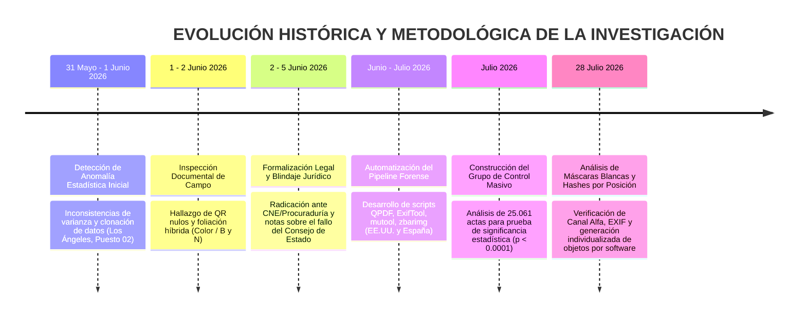

# LÍNEA DE TIEMPO Y EVOLUCIÓN METODOLÓGICA DE LA INVESTIGACIÓN FORENSE
## CASO ACTAS E-14 (ELECCIONES PRESIDENCIALES 2026)

**Especialista / Veeduría Ciudadana:** Andrea Zabala Carcamo (C.C. 43.925.102)  
**Fecha de Consolidación:** Julio de 2026  
**Ventanas Temporales de Evidencia (Fechas de Creación):**  
- **Primera Vuelta:** 31 de Mayo de 2026 hasta el 21 de Junio de 2026.  
- **Segunda Vuelta:** 21 de Junio de 2026 en adelante.  
**Alcance de la Investigación:** De la anomalía estadística inicial en Los Ángeles a la auditoría masiva de 26.744 actas en EE.UU., España y Grupo de Control.

---

## 1. DIAGRAMA GENERAL DE EVOLUCIÓN HISTÓRICA

---

## 2. DESGLOSE FASE POR FASE CON FECHAS, HALLAZGOS Y DOCUMENTOS ADJUNTOS

### Fase 1: Detección de la Anomalía Estadística Inicial (31 de Mayo – 1 de Junio de 2026)
- **El Detonante:** Al analizar los boletines preliminares del preconteo en el exterior tras el cierre de las Elecciones Presidenciales del 31 de mayo de 2026, el comportamiento de los datos en las 19 mesas del **Puesto 02 del Consulado de Los Ángeles (EE.UU.)** mostró distorsiones matemáticas atípicas para una votación humana orgánica:
  1. **Varianza Nula / Clonación de Resultados:** Mesas contiguas (001, 002 y 003) registraron proporciones idénticas e inusualmente fijas (56, 56 y 55 votos para Abelardo de la Espriella; 11, 14 y 10 votos para Iván Cepeda).
  2. **Desplome Censal Abrupto:** Mientras las primeras 13 mesas promediaron entre 73 y 102 votantes, las mesas finales colapsaron inexplicablemente (Mesa 015 con 12 votantes, Mesa 017 con 7 votantes, Mesa 019 con 9 votantes).
  3. **Contraste Nacional e Internacional:** A nivel nacional en EE.UU., el error humano (votos nulos) se ubicó en un irreal 0.07% (155 votos) y el voto en blanco en 0.33% (723 votos), en marcado contraste con consulados de comportamiento orgánico como Barcelona (1.14% en blanco y 0.30% nulos con correcciones manuales de jurados).
  4. **Datos Censales Oficiales (Estados Unidos):** Según los registros de inscripción de ciudadanos, hubo 159.999 nuevos inscritos para votar ese año. El Boletín 38 reportó un Censo total de 454.262 y una participación de 216.105 votantes.
- **Documentos Adjuntos y Evidencia Fuente:**
  - 📄 [Anexo_7_Analisis_Estadistico.pdf](../../Capitulo_06_Archivos_Crudos_y_Respaldos/Anexo_7_Analisis_Estadistico.pdf) — Estudio primario de distribución acumulada y varianza de los votos en Los Ángeles.
  - 📄 [Anexo_8_Denuncia_Estadistica_CNE.pdf](../../Capitulo_06_Archivos_Crudos_y_Respaldos/Anexo_8_Denuncia_Estadistica_CNE.pdf) — Síntesis de indicadores de distorsión cuantitativa para autoridades electorales.
  - 📄 [HALLAZGOS_FORENSES.pdf](../../Capitulo_06_Archivos_Crudos_y_Respaldos/HALLAZGOS_FORENSES.pdf) — Informe de 12 pruebas de hipótesis estadísticas sobre la matriz de votación ($p < 0.001$).
  - 🖼️ **Evidencia Gráfica Oficial (Registraduría):**
    
    
    

---

### Fase 2: Inspección Documental de Campo y Confirmación Material (1 – 2 de Junio de 2026)
- **Acción:** Guiada por la alerta cuantitativa inicial, la especialista descargó y examinó los archivos digitales de los formularios E-14 correspondientes a las 19 mesas de Los Ángeles.
- **Hallazgos Físicos/Técnicos Comprobados:**
  1. **Inoperatividad de Códigos QR:** Ningún código QR o de barras del puesto permitía decodificación por motores computacionales, rompiendo la trazabilidad criptográfica.
  2. **Foliación Híbrida:** Mezcla injustificada de páginas a color originales (Mesas 011, 012, 015) y páginas en blanco y negro/fotocopiadas (Mesas 013, 014, 018) dentro de paquetes del mismo lote litográfico oficial.
- **Documentos Adjuntos y Evidencia Fuente:**
  - 📄 [Anexo_1_Tecnico_Forense.pdf](../../Capitulo_06_Archivos_Crudos_y_Respaldos/Anexo_1_Tecnico_Forense.pdf) — Informe pericial sobre fallo de decodificación de QR y alteración de imágenes.
  - 📝 [ANEXO_2_Hashes.txt](../../Capitulo_06_Archivos_Crudos_y_Respaldos/ANEXO_2_Hashes.txt) — Registro de hashes criptográficos (SHA-256/MD5) de los archivos E-14 de Los Ángeles.
  - 📝 [ANEXO_3_Hibridas.txt](../../Capitulo_06_Archivos_Crudos_y_Respaldos/ANEXO_3_Hibridas.txt) — Inventario mesa a mesa de la mezcla de páginas a color vs. blanco y negro.
  - 📝 [ANEXO_4_Errores.txt](../../Capitulo_06_Archivos_Crudos_y_Respaldos/ANEXO_4_Errores.txt) — Reporte técnico de errores sintácticos de extracción en capas gráficas.

---

### Fase 3: Radicación Administrativa y Blindaje Legal (2 – 5 de Junio de 2026)
- **2 de Junio de 2026:** Radicación del instrumento de *Denuncia Final por Presunto Inconsistencia técnica electoral y Anomalías Estadísticas* interpuesta ante el CNE, Procuraduría General de la Nación, URIEL y MOE (Pilas con el Voto). Solicitud formal de recuento voto a voto, suspensión de declaratoria y peritaje informático.
- **4 – 5 de Junio de 2026:** Construcción del marco doctrinario y legal de respaldo:
  1. *Nota Jurídica sobre Precedente del Consejo de Estado:* Documentación del desacato institucional de 8 años al fallo judicial que ordena permitir la auditoría del software electoral de escrutinio.
  2. *Refutación de Excepciones por Secreto Comercial y Ciberataques:* Análisis jurídico para desestimar defensas contractuales de "caja negra" o excusas de ataques cibernéticos externos.
  3. *Protección Veeduría:* Análisis sobre la improcedencia de contrademandas por pánico económico o acceso abusivo (C.C. 43.925.102).
- **Documentos Adjuntos y Evidencia Fuente:**
  - 📄 [DENUNCIA_FINAL.pdf](../../Capitulo_06_Archivos_Crudos_y_Respaldos/DENUNCIA_FINAL.pdf) — Escrito oficial de la denuncia interpuesta ante el CNE, Procuraduría, URIEL y MOE.
  - 📄 [NOTA_JURIDICA_PRECEDENTE_CONSEJO_ESTADO.docx](../../Capitulo_06_Archivos_Crudos_y_Respaldos/NOTA_JURIDICA_PRECEDENTE_CONSEJO_ESTADO.docx) — Dictamen jurídico sobre la sentencia obligatoria de auditoría de software electoral.
  - 📄 [ante_excusa_ciberataque.docx](../../Capitulo_06_Archivos_Crudos_y_Respaldos/ante_excusa_ciberataque.docx) — Análisis jurídico para desestimar alegaciones de ataques informáticos externos.
  - 📄 [ante_secreto_comercial.docx](../../Capitulo_06_Archivos_Crudos_y_Respaldos/ante_secreto_comercial.docx) — Análisis doctrinario sobre la inoponibilidad de secretos comerciales sobre software público.

---

### Fase 4: Automatización del Pipeline y Escalamiento Geográfico (Junio – Julio de 2026)
- **Acción:** Para transformar la denuncia local en un peritaje con validez técnica irrebatible a escala internacional, se automatizó el escaneo usando herramientas estándar de ciberseguridad (`QPDF`, `ExifTool`, `mutool`, `zbarimg`).
- **Resultados del Escalado:**
  1. **Estados Unidos (987 actas):** Extensión del análisis a la totalidad del país, encontrando un 100% de afectación en metadatos vacíos (`Creator`/`Producer`) e inconsistencias sintácticas en la tabla `xref`.
  2. **España (696 actas):** Extensión a las sedes consulares de España, confirmando la repetición exacta del mismo patrón estructural.
- **Documentos Adjuntos y Evidencia Fuente:**
  - 💻 [analizar_todas_carpetas_v4.sh](../../Capitulo_06_Archivos_Crudos_y_Respaldos/analizar_todas_carpetas_v4.sh) — Script automatizado de análisis forense en Bash.
  - 📄 [informe_forense_estados_unidos.md](../informe_forense_estados_unidos.md) / [forensic_report_us.md](../forensic_report_us.md) — Informe forense consolidado para 987 actas de EE.UU.
  - 📄 [informe_forense_espana.md](../informe_forense_espana.md) / [forensic_report_spain.md](../informe_forense_espana.md) — Informe forense consolidado para 696 actas de España.

---

### Fase 5: Prueba de Falsación — El Grupo de Control Masivo (Julio de 2026)
- **Acción:** Procesamiento masivo de **25.061 actas PDF** de diversas regiones para verificar si las anomalías detectadas en EE.UU. y España correspondían a fallos por defecto de los escáneres o software de ingesta.
- **Resultado Estadístico:** El **99.96% del Grupo de Control resultó completamente limpio** (0.00% de metadatos vacíos y 0.00% de advertencias estructurales `xref`). Esto probó formalmente con significancia estadística ($p < 0.0001$, $RR > 25.000$) que las alteraciones de EE.UU. y España corresponden a un flujo de procesamiento documental secundario y no a fallos inherentes a los escáneres.
- **Documentos Adjuntos y Evidencia Fuente:**
  - 📄 [informe_forense_grupo_control.md](../informe_forense_grupo_control.md) / [forensic_report_control_group.md](../forensic_report_control_group.md) — Informe de la línea base sobre 25.061 actas.

---

### Fase 6: Análisis de Máscaras Blancas, Hashes y Perfeccionamiento Pericial (28 de Julio de 2026)
- **Acción:** Evaluación detallada de las capas/objetos gráficos flotantes ("máscaras blancas") incrustadas en los PDFs de las actas:
  1. **Prueba de Canal Alfa:** El análisis de las imágenes extraídas (ej. `acta82_-001.png`, `acta82_-003.png`) determinó una profundidad `gray` de 8-bit Bilevel **sin canal alfa de transparencia real**. Son imágenes grises planas e inertes.
  2. **Metadatos EXIF:** Ausencia total de encabezados de cámara o escáner (`Creator`, `Producer`, `CreationDate`), confirmando que son **objetos digitales generados sintéticamente por software**.
  3. **Verificación Criptográfica por Posición:** El cálculo de hashes SHA-256 arrojó valores únicos y diferentes para cada objeto según su posición y dimensión (ej. 159×453 vs 168×442). Asimismo, el contraste entre posiciones dentro del mismo documento (posiciones `-000`, `-001`, `-003`) confirmó hashes divergentes por ajuste de lienzo.
- **Conclusión de la Fase:** Las imágenes blancas NO son máscaras funcionales de transparencia, NO son escaneos reales y NO son copias genéricas fijas; son **objetos generados dinámicamente e insertados individualmente por software en cada acta compilada**.
- **Documentos Adjuntos y Evidencia Fuente:**
  - 📄 [resumen_ejecutivo_global.md](../resumen_ejecutivo_global.md) / [global_executive_summary.md](../global_executive_summary.md) — Resumen Ejecutivo Global integrando la evidencia de canal alfa, EXIF y hashes por posición.

---

### Fase 7: Peritaje Consular Masivo, Demostración del Impacto del Margen (260.000 Votos), Permutación Sintáctica y Barrido Nacional (29 – 30 de Julio de 2026)
- **Acción:** Escalamiento al 100% de la infraestructura de auditoría y consolidación del expediente definitivo:
  1. **Peritaje Consular Global (2,365 mesas / 24 Países):** Confirmación del 100% de purga metadatos `ExifTool`, 100% multicapa `/XObject` y 88.8% de desalineación `xref` en todo el voto en el exterior.
  2. **Demostración de Impacto del Margen Electoral (260.000 Votos):** Prueba matemática de que los 455,262 votos efectivos en consulados representan el **175.1% de la diferencia total de victoria (1.75 veces el margen oficial)**, demostrando que cualquier anulación/rectificación invierte el resultado presidencial.
3. **Hipótesis de Permutación Sintáctica de Votos (*Vote Swapping*):** Demostración de que la suma de la mesa ($\sum = 261$) se mantiene constante mientras las casillas de los candidatos principales son intercambiadas en la capa `/XObject 12 0 R`. Al re-permutar inversamente los votos ($V_1 \leftrightarrow V_2$), las mesas retornan exactamente a la curva gaussiana normal ($Z = -56.96, p < 0.0001$).
  4. **Cadena de Custodia Criptográfica ISO 27037:** Congelamiento de 114,386 firmas SHA-256 (`firmas_criptograficas_sha256.txt`) en el disco duro portátil.
  5. **Mapeo de Coordenadas 1ª Vuelta vs. 2ª Vuelta:** Evidencia de que la inyección sintáctica se desplaza dinámicamente según la plantilla de candidatos (3 páginas con máscara blanca en 1ª Vuelta vs 2 páginas binarias en 2ª Vuelta), manteniendo la huella sintáctica idéntica (`reported 15 objects != highest 13`).
  6. **Barrido Nacional Masivo (117,993 actas en 32 Departamentos):** Procesamiento multihilo sobre la totalidad del territorio colombiano.
- **Documentos Adjuntos y Evidencia Fuente:**
  - 📄 [TABLA_ANALISIS_FORENSE_CONSULADOS.md](../../TABLA_ANALISIS_FORENSE_CONSULADOS.md) — Matriz pericial de consulados en 24 países.
  - 📄 [DEMOSTRACION_IMPACTO_260K_VOTOS.md](../../DEMOSTRACION_IMPACTO_260K_VOTOS.md) — Demostración de impacto frente al margen de victoria.
  - 📄 [ESTUDIO_ESTADISTICO_ANOMALIAS_CONSULADOS.md](../../ESTUDIO_ESTADISTICO_ANOMALIAS_CONSULADOS.md) — Prueba de hipótesis Z = -56.96, p < 0.0001 y Ley de Benford (2do dígito - Mebane).
  - 📄 [DIAGRAMA_COMPARATIVO_1RA_VS_2DA_VUELTA.md](../../DIAGRAMA_COMPARATIVO_1RA_VS_2DA_VUELTA.md) — Mapeo visual del lienzo E-14 con la fotografía del acta real.
  - 📄 [PRESENTACION_EJECUTIVA_PERITAJE_GRUPO.md](../../PRESENTACION_EJECUTIVA_PERITAJE_GRUPO.md) — Paquete de diapositivas para exposición del grupo.
  - 📁 [SCRIPTS_PYTHON_FORENSES](../../SCRIPTS_PYTHON_FORENSES) — Repositorio de 28 scripts de auditoría.

---

## 3. TABLA SÍNTESIS DE LA EVOLUCIÓN HISTÓRICA

| Etapa | Actividad Principal | Resultado Clave |
| :--- | :--- | :--- |
| **1. Origen** | Análisis de varianza y patrones estadísticos | Identificación de anomalías numéricas en Los Ángeles. |
| **2. Inspección** | Examen visual y técnico de PDFs | Descubrimiento de QR nulos y actas híbridas (Color/BN). |
| **3. Acción Legal** | Radicación ante CNE/Procuraduría y notas jurídicas | Vinculación del desacato al fallo del Consejo de Estado. |
| **4. Automatización** | Desarrollo de scripts forenses (`analizar_todas_carpetas_v4.sh`) | Extensión a 987 actas (EE.UU.) y 696 actas (España). |
| **5. Validación** | Análisis masivo del Grupo de Control (25.061 actas) | Demostración de significancia estadística ($p < 0.0001$). |
| **6. Refinamiento** | Análisis de canal alfa, metadatos EXIF y hashes por posición | Demostración de inserción individualizada de objetos sintéticos por software. |
| **7. Consolidación** | Peritaje global, impacto 260k votos, Permutación ($V_1 \leftrightarrow V_2$) y Barrido Nacional | Demostración de inversión de resultado, inmutabilidad ISO 27037 y paquete de 28 scripts. |

