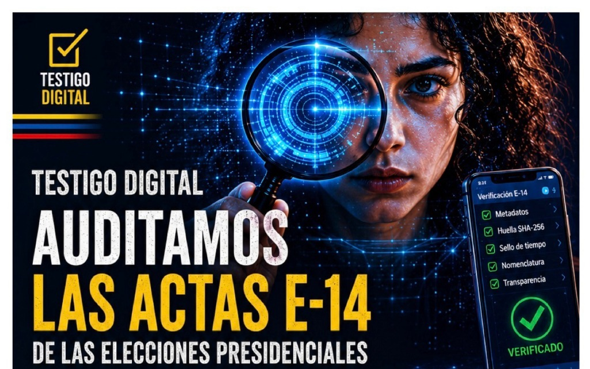
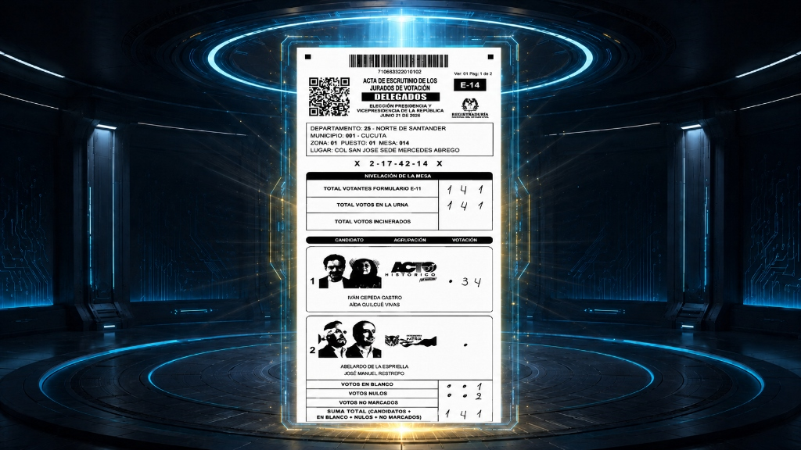

<div align="center">
  
</div>

<div align="center">
  <b>🌍 Traducción Automática / Live Translation:</b><br>
  <a href="https://translate.google.com/translate?sl=es&tl=en&u=https://github.com/anzaca0330-pixel/AndreTaker---AnZaCa-Rep">🇺🇸 English</a> | 
  <a href="https://translate.google.com/translate?sl=es&tl=fr&u=https://github.com/anzaca0330-pixel/AndreTaker---AnZaCa-Rep">🇫🇷 Français</a> | 
  <a href="https://translate.google.com/translate?sl=es&tl=de&u=https://github.com/anzaca0330-pixel/AndreTaker---AnZaCa-Rep">🇩🇪 Deutsch</a> | 
  <a href="https://translate.google.com/translate?sl=es&tl=pt&u=https://github.com/anzaca0330-pixel/AndreTaker---AnZaCa-Rep">🇧🇷 Português</a> |
  <a href="https://translate.google.com/translate?sl=es&tl=zh-CN&u=https://github.com/anzaca0330-pixel/AndreTaker---AnZaCa-Rep">🇨🇳 中文 (Chinese)</a>
</div>
<br>

# 🕊️ ACERVO PROBATORIO FORENSE E-14 (COLOMBIA 2026)

**Investigadora:** Andrea Zabala Cárcamo  
**Colectivo:** Frente Digital 2026  
**Radicado CIDH:** `IACHR-0000113728`  
**Estado:** Evidencia preservada, blindada y disponible para peritaje internacional.

⚖️ **[MANIFIESTO LEGAL Y CONSTITUCIONAL (Español)](03_DOCUMENTACION/MANIFESTO_TESTIGO_DIGITAL_ES.md)**  
⚖️ **[LEGAL AND CONSTITUTIONAL MANIFESTO (English)](03_DOCUMENTACION/MANIFESTO_TESTIGO_DIGITAL_EN.md)**  

---

## 📌 Índice Rápido

1. [Contexto del Caso / About](#contexto-del-caso--about)
2. [Hallazgos Principales](#hallazgos-principales)
3. [Estructura del Repositorio](#estructura-del-repositorio)
4. [Cómo Usar Este Repositorio](#cómo-usar-este-repositorio)
5. [Cadena de Custodia y Bóvedas](#cadena-de-custodia-y-bóvedas)
6. [Cómo Contribuir (Peer Review)](#cómo-contribuir-peer-review)

---

## 📖 Contexto del Caso / About

<div align="center">
  
  <br>
  <em>Aislamiento y auditoría cuántica de un acta E-14 manipulada.</em>
</div>

**[ES]** Este repositorio es una bitácora técnica de código abierto y una bóveda de preservación de evidencia digital. Contiene las herramientas analíticas, scripts de auditoría matemática e informática, y dictámenes periciales independientes generados durante el análisis técnico de los comicios presidenciales (1ra y 2da Vuelta) de 2026 en Colombia. Toda la evidencia y metodología fue documentada bajo estrictos estándares forenses para soportar el caso presentado ante la Comisión Interamericana de Derechos Humanos (CIDH) y la comunidad internacional.

**[EN]** This repository is an open-source technical log and digital evidence preservation vault. It contains the analytical tools, mathematical and computer forensic audit scripts, and independent expert opinions generated during the technical analysis of the 2026 presidential elections in Colombia. All evidence and methodology were documented under strict forensic standards to support the case presented before the Inter-American Commission on Human Rights (IACHR) and the international community.

A través del esfuerzo masivo de más de 75,000 "Testigos Digitales", se descargaron y aseguraron los formularios E-14 antes de que sufrieran alteraciones irreparables. El análisis pericial contenido aquí demuestra, de forma matemática e informática, la manipulación estructural e inyección sintética (falsificación digital) de la voluntad popular, orientada a desviar sistemáticamente los resultados.

### 📊 Volumen Analizado por Fases (Audit Scope)

Para garantizar rigor científico, la auditoría forense escaló en tres fases de volumen documental:
*   **Fase 1 (Muestras de Control Nacionales):** Auditoría manual y estadística sobre un dataset de control de **~500 actas** de departamentos clave (ej. Antioquia) para establecer la línea base de un escaneo legítimo vs. uno falsificado.
*   **Fase 2 (Foco del Fraude - Voto en el Exterior):** Análisis profundo de anomalías en los Consulados (Estados Unidos, España, etc.), abarcando actas que representan **más de 100,000 votos**. Aquí se aisló por primera vez la técnica de censura *Blind Masking*.
*   **Fase 3 (Auditoría Masiva Estructural - Acervo Completo):** Escaneo automatizado mediante *multiprocessing* sobre **121,960 PDFs** (la totalidad absoluta de los documentos E-14 de Delegados depositados en la bóveda principal). El 100% de la muestra total fue procesada en busca de la corrupción estructural (XREF).

---

## 🔍 Hallazgos Principales

El peritaje científico demuestra la falsificación a través de tres pilares técnicos irrefutables:

- **1. La "Cicatriz" Estructural (XREF):** El 100% de los formularios alterados (falsificados) presentan una tabla de referencias cruzadas (`XREF`) corrompida (15 objetos declarados vs 13 existentes), producto del uso de software de ensamblaje masivo de PDFs en lugar de escáneres ópticos reales.
- **2. Blind Masking (Capas y Vectores):** Los documentos falsificados contienen comandos vectoriales (`cm`, `re`, `Do`), máscaras tipo `DeviceGray` y números renderizados en formato de 1 bit por canal (`1bpc`), superpuestos sobre fondos ruidosos. Un escáner físico de mesa de votación **nunca** crea capas ni hace OCR selectivo; solo produce imágenes planas acopladas.

<div align="center">
  
  <br>
  <em>Comparativa visual (Mapa de Diferencias): Los "puntos rojos" revelan la inyección de la capa vectorial superpuesta sobre el escaneo original.</em>
</div>

- **3. El "Espejo Absoluto" y Ley de Benford:** Anomalías estadísticas imposibles en la naturaleza humana. Desviaciones estándar en la distribución del Segundo Dígito y secuencias (o "melodías") algorítmicas repetitivas en los bloques de transmisión, comprobando que los números fueron inyectados por un bucle de programación y no por conteo humano.

---

## 📂 Estructura del Repositorio

Para facilitar la auditoría, el repositorio se divide en tres grandes bloques:

| Carpeta | Contenido |
| :--- | :--- |
| `01_EVIDENCIA/` | Archivos de hashes inmutables, datasets `.csv`, y el mapa del acervo de 121,960 PDFs. |
| `02_ANALISIS/` | Scripts de auditoría automatizada en Python y Bash, simulaciones Monte Carlo, y reportes periciales. |
| `03_DOCUMENTACION/` | Resumen Ejecutivo, Guía para Jueces, manifiestos legales y la cronología de los ciberataques. |

Consulte el archivo **[`INDICE_MAESTRO.md`](INDICE_MAESTRO.md)** para una navegación detallada por cada archivo.

📘 **Marco Legal y Académico:** Toda la base normativa, estándares ISO forenses y sustento estadístico de esta auditoría se encuentran detallados en la **[`BIBLIOGRAFÍA ACADÉMICA Y TÉCNICA`](03_DOCUMENTACION/BIBLIOGRAFIA_FORENSE_CIDH.md)**.

---

## 🛠️ Cómo Usar Este Repositorio

### Para Peritos Externos y Auditores (Peer Review)

1. Clona el repositorio en tu entorno local (preferiblemente Linux).
2. Instala las herramientas forenses necesarias:
   ```bash
   sudo apt-get update && sudo apt-get install qpdf poppler-utils libimage-exiftool-perl python3
   ```
3. Ejecuta los scripts de validación sobre cualquier muestra de la bóveda:
   ```bash
   ./02_ANALISIS/SCRIPTS_PYTHON_FORENSES/auditoria_masiva_xref.sh "ruta/a/muestra" "resultados_muestra.csv"
   ```

### Para Autoridades, Jueces o Ciudadanos
- Comience leyendo el **[Resumen Ejecutivo](03_DOCUMENTACION/RESUMEN_EJECUTIVO.md)**.
- Para entender los conceptos técnicos de la falsificación en términos sencillos, lea la **[Guía Didáctica para Jueces](03_DOCUMENTACION/GUIA_PARA_JUECES.md)**.
- 😃 **[Informe Unificado "Carita Feliz" (Exhibición Visual - PDF)](03_DOCUMENTACION/CARITA_FELIZ_DELIVERABLE/INFORME_UNIFICADO_CARITA_FELIZ.pdf)**: Demostración forense visual paso a paso que comprueba cómo funciona la manipulación de píxeles (Blind Masking) en la realidad.

**Informes Periciales Específicos (Casos de Estudio de la Fase 2):**
- 🇺🇸 **[Análisis Forense - Estados Unidos (Consulados)](02_ANALISIS/informe_forense_estados_unidos.md)**: El epicentro técnico donde se descubrió la inyección del *Blind Masking*.
- 🇪🇸 **[Análisis Forense - España (Consulados)](02_ANALISIS/informe_forense_espana.md)**: Análisis de la réplica algorítmica y sustitución de páginas en Europa.
- 🇨🇴 **[Análisis Forense - Grupo de Control (Antioquia)](02_ANALISIS/informe_forense_grupo_control.md)**: Línea base matemática de cómo luce un departamento libre de falsificación estructural.

---

## 🌐 BÓVEDAS INMUTABLES EN INTERNET ARCHIVE

Todo el acervo probatorio ha sido preservado en **Internet Archive**, una plataforma pública e inmutable que garantiza la integridad y accesibilidad de la evidencia a perpetuidad. Los archivos están congelados con sus respectivos hashes SHA-256 para verificar su autenticidad.

| Bóveda | Contenido | Enlace |
| :--- | :--- | :--- |
| **Acervo Probatorio Completo** | Archivo `ENTREGABLES_FORENSES_E14_COMPLETO.zip`. Contiene todos los capítulos, scripts, informes y bases de datos. | [🔗 Acceder](https://archive.org/details/colombia-e14-forensic-acervo-2026) |
| **Scripts y Reportes Técnicos** | Archivos sueltos de scripts Python/Bash, informes forenses y análisis estadísticos. Ideal para peritos que quieran revisar la metodología. | [🔗 Acceder](https://archive.org/details/paquete-forense-scripts-y-reportes) |
| **Actas E-14 de Delegados** | Archivo `ACERVO_DELEGADOS_121K.zip` (15 GB). Copias digitales de las actas de Delegados (21 de junio de 2026). Documentación fuente de la manipulación estructural. | [🔗 Acceder](https://archive.org/details/colombia-e14-forensic-acervo-2026) |

> ⚠️ **Verificación de Integridad:** Cada archivo en estas bóvedas puede ser verificado mediante su hash SHA-256. Los hashes maestros están documentados en `01_EVIDENCIA/MUESTRAS_CONTROL_HASHES.md` dentro de este repositorio.

---

## 🤝 Cómo Contribuir (Peer Review)

El rigor científico requiere revisión independiente. Hacemos un llamado a la comunidad internacional de ciberseguridad, estadística e informática forense:
- **No reescribas el código, valida nuestra metodología.**
- Abre un *Issue* si encuentras vulnerabilidades o errores en los scripts.
- Comparte este repositorio con organizaciones internacionales de derechos humanos.

---

## 🇨🇴 Autoría Colectiva y Dedicatoria

**Este repositorio no me pertenece a mí, le pertenece a Colombia.**

Este trabajo es posible gracias a la articulación de la **PRIMERA LÍNEA DIGITAL - FRENTE DIGITAL**, una red de más de **75.000 "Testigos Digitales"** que descargaron, verificaron y protegieron la evidencia digital cuando los servidores oficiales fallaron.

Aunque mi nombre (Andrea Zabala Cárcamo - ANZACA AndreTaker) figura como coordinadora de la estructura técnica y pericial, este esfuerzo monumental fue impulsado por la fuerza colectiva de ciudadanos comunes que se organizaron para defender la transparencia electoral.

**Dedicamos este peritaje científico y forense:**
- A la **gente** que salió a votar masivamente, impulsada por la esperanza y el deber cívico.
- Por sus **tierras y territorios**, pilares de la soberanía de nuestras comunidades.
- Por **nuestra selva y nuestras aguas**, que requieren protección y voces que las defiendan.
- Por **nuestros animales**, que son sagrados y dependen del futuro que construimos hoy.
- Por mi **mamá y mi hermana**, que siguen allá resistiendo.
- Por **mis amigos y por los hijos de mis amigos**, a quienes les debemos un país donde la verdad no sea borrada.
- Y por mi **abuelo**, que siempre me dijo que el mejor país del mundo es Colombia... y le creo.

**Este repositorio es la prueba inmutable y matemática de que la voz de los colombianos existió, fue registrada y no será borrada.**

---

**PRIMERA LÍNEA DIGITAL - FRENTE DIGITAL ANZACA AndreTaker**  
*Auditoría Ciudadana por la Transparencia Electoral*  
🌐 [testigosdigitales2026.com](https://testigosdigitales2026.com/)

**Agradecimiento y Apoyo en Investigación:**  
*[Laboratorio de Investigación FITE](https://testigodigital.co/)*
