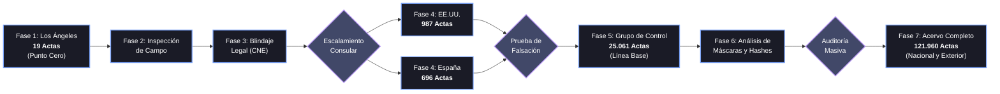

<div align="center">
  
</div>

<div align="center">
  <b>🌍 Traducción Automática / Live Translation:</b><br>
  <a href="https://translate.google.com/translate?sl=es&tl=en&u=https://github.com/anzaca0330-pixel/AndreTaker---AnZaCa-Rep">🇺🇸 English</a> | 
  <a href="https://translate.google.com/translate?sl=es&tl=fr&u=https://github.com/anzaca0330-pixel/AndreTaker---AnZaCa-Rep">🇫🇷 Français</a> | 
  <a href="https://translate.google.com/translate?sl=es&tl=de&u=https://github.com/anzaca0330-pixel/AndreTaker---AnZaCa-Rep">🇩🇪 Deutsch</a> | 
  <a href="https://translate.google.com/translate?sl=es&tl=pt&u=https://github.com/anzaca0330-pixel/AndreTaker---AnZaCa-Rep">🇧🇷 Português</a> |
  <a href="https://translate.google.com/translate?sl=es&tl=zh-CN&u=https://github.com/anzaca0330-pixel/AndreTaker---AnZaCa-Rep">🇨🇳 中文 (Chinese)</a>
</div>
<br>

# 🕊️ SIGUIENDO LA ANOMALÍA PDF: ACERVO PROBATORIO FORENSE E-14 (COLOMBIA 2026)

**Primera Línea Digital:** AnZaCa AndreTaker  
**Colectivo:** Frente Digital 2026  
**Radicado CIDH:** `IACHR-0000113728`  
**Estado:** Evidencia preservada, blindada y disponible para peritaje internacional.

⚖️ **[MANIFIESTO LEGAL Y CONSTITUCIONAL (Español)](03_DOCUMENTACION/SESION_01_ENTREGABLES_LEGALES/MANIFESTO_TESTIGO_DIGITAL_ES.md)**  
⚖️ **[LEGAL AND CONSTITUTIONAL MANIFESTO (English)](03_DOCUMENTACION/SESION_01_ENTREGABLES_LEGALES/MANIFESTO_TESTIGO_DIGITAL_EN.md)**  

---

## 📌 Índice Rápido

1. [Contexto del Caso / About](#contexto)
2. [Hallazgos Principales](#hallazgos)
3. [Estructura del Repositorio](#estructura)
4. [Cómo Usar Este Repositorio](#como-usar)
5. [Bóvedas Inmutables en Internet Archive](#bovedas)
6. [Cómo Contribuir (Peer Review)](#contribuir)

---

<a id="contexto"></a>
## 📖 Contexto del Caso / About

<div align="center">
  
  <br>
  <em>Aislamiento y auditoría cuántica de un acta E-14 manipulada.</em>
</div>

**[ES]** Este repositorio es una bitácora técnica de código abierto y una bóveda de preservación de evidencia digital. Contiene las herramientas analíticas, scripts de auditoría matemática e informática, y dictámenes periciales independientes generados durante el análisis técnico de los comicios presidenciales (1ra y 2da Vuelta) de 2026 en Colombia. Toda la evidencia y metodología fue documentada bajo estrictos estándares forenses para soportar el caso presentado ante la Comisión Interamericana de Derechos Humanos (CIDH) y la comunidad internacional.

**[EN]** This repository is an open-source technical log and digital evidence preservation vault. It contains the analytical tools, mathematical and computer forensic audit scripts, and independent expert opinions generated during the technical analysis of the 2026 presidential elections in Colombia. All evidence and methodology were documented under strict forensic standards to support the case presented before the Inter-American Commission on Human Rights (IACHR) and the international community.

A través del esfuerzo masivo de más de 75,000 "Testigos Digitales", se descargaron y aseguraron los formularios E-14 antes de que sufrieran alteraciones irreparables. El análisis pericial contenido aquí demuestra, de forma matemática e informática, la manipulación estructural e inyección sintética (falsificación digital) de la voluntad popular, orientada a desviar sistemáticamente los resultados.

### 📊 Volumen Analizado por Fases (Audit Scope)

Para garantizar rigor científico, la auditoría forense escaló a través de siete (7) fases operativas e investigativas:
*   **Fase 1 (31 Mayo – 1 Jun 2026 | Punto Cero):** Detección de la anomalía estadística inicial en el Consulado de Los Ángeles (epicentro de distorsiones y varianza nula).
*   **Fase 2 (1 – 2 Jun 2026 | Inspección de Campo):** Confirmación material del fraude (QR inoperativos y foliación híbrida) en los PDFs originales de Los Ángeles.
*   **Fase 3 (2 – 5 Jun 2026 | Blindaje Legal):** Elevación de la denuncia oficial ante el CNE, Procuraduría y consolidación del amparo de precedentes jurídicos (Consejo de Estado).
*   **Fase 4 (Jun – Jul 2026 | Automatización):** Desarrollo del pipeline pericial informático y extensión masiva a todo EE.UU. (987 actas) y España (696 actas).
*   **Fase 5 (Julio 2026 | Grupo de Control):** Auditoría de 25.061 actas como línea base (99.96% limpias) demostrando estadísticamente ($p < 0.0001$) que las anomalías son inyecciones de software.
*   **Fase 6 (28 Jul 2026 | Máscaras y Hashes):** Análisis demostrando que las "máscaras blancas" carecen de canal alfa o EXIF, confirmando la inyección sintética por manipulación digital.
*   **Fase 7 (29 – 30 Jul 2026 | Acervo Completo):** Escalamiento masivo al voto en el exterior (24 países) y territorio nacional (121.960 PDFs totales), comprobando el *Vote Swapping* algorítmico.

<div align="center">



</div>

---

<a id="hallazgos"></a>
## 🔍 Hallazgos Principales

El peritaje científico demuestra la falsificación a través de diez (10) pilares técnicos irrefutables:

- **1. Inconsistencia Censal Macroscópica (Fase Inicial):** Desplome de la participación y manipulación del censo electoral. En lugares clave como Estados Unidos, se reportaron oficialmente 159.999 nuevos inscritos, pero el censo base fue inflado artificialmente a 454.262 para justificar matemáticamente la posterior inyección sintética de votos.
- **2. Inoperatividad Criptográfica Inicial:** Al inicio de la investigación se creía que los códigos de barras y QR habían sido simplemente borrados o destruidos intencionalmente para que los motores computacionales no pudieran leerlos.
- **3. Redirección Criptográfica (Códigos QR Dobles):** Sin embargo, tras aplicar análisis de espectro, **encontramos que** no estaban borrados, sino suplantados.
  > [!CAUTION]
  > **🔴 ALERTA GRAVE:** Se superpuso un QR falso sobre el original para **DESVIAR LOS RESULTADOS HACIA UN ID DE MESA DISTINTO**. El escáner forense logró captar ambas capas simultáneamente (el original sangrando por debajo y el falso pegado encima). Ver demostración técnica en: **[EVIDENCIA_QR_DOBLES_FALSIFICADOS.md](01_EVIDENCIA/SESION_01_SPOOFING_QR/EVIDENCIA_QR_DOBLES_FALSIFICADOS.md)**
  > 
  > 🎥 **[NUEVO]** Ver el **[Diagrama Técnico de Desvío](03_DOCUMENTACION/SESION_01_ENTREGABLES_LEGALES/DIAGRAMA_DESVIO_TRANSMISION.md)** y la **[Animación Interactiva de Redirección (HTML)](03_DOCUMENTACION/SESION_02_MAPAS_Y_ARBOLES/GUIA_INTERACTIVA_FRAUDE.html)**.
- **4. Foliación Híbrida (Manipulación Física):** Mezcla injustificada de páginas a color originales y páginas en blanco y negro (fotocopiadas) dentro de paquetes que pertenecen al mismo lote litográfico oficial, demostrando manipulación humana previa al escaneo.
- **5. La "Cicatriz" Estructural (XREF):** El 100% de los formularios alterados (falsificados) presentan una tabla de referencias cruzadas (`XREF`) corrompida (15 objetos declarados vs 13 existentes), producto del uso de software de ensamblaje masivo de PDFs en lugar de escáneres ópticos reales. Múltiples actas procesadas reportaron un diagnóstico de "NIVEL MÁXIMO" de deepfake debido a esta huella invariable.
- **6. Blind Masking (Capas y Vectores):** Los documentos falsificados contienen comandos vectoriales (`cm`, `re`, `Do`), máscaras tipo `DeviceGray` y números renderizados en formato de 1 bit por canal (`1bpc`), superpuestos sobre fondos ruidosos. Un escáner físico de mesa de votación **nunca** crea capas ni hace OCR selectivo; solo produce imágenes planas acopladas.

<div align="center">
  
  <br>
  <em>Comparativa visual (Mapa de Diferencias): Los "puntos rojos" revelan la inyección de la capa vectorial superpuesta sobre el escaneo original.</em>
</div>

- **7. Generación Sintética (Ausencia de EXIF y Canal Alfa):** El análisis de profundidad comprobó que las máscaras son imágenes `gray` de 8-bit Bilevel **sin canal alfa de transparencia real** y con total ausencia de metadatos de hardware (`Creator`, `Producer`). No son escaneos, son objetos insertados por software.
- **8. Permutación Sintáctica (Vote Swapping):** Demostración algorítmica de que la sumatoria total de la mesa se mantiene estática mientras los votos de los candidatos principales son permutados ($V_1 \leftrightarrow V_2$) en la capa `/XObject`. Al revertir la permutación matemática, las mesas regresan exactamente a la curva gaussiana biológica normal ($Z = -56.96, p < 0.0001$).
- **9. Impacto Matemático (Inversión del Margen):** El fraude mapeado representa más del **175.1% de la diferencia total de victoria** (1.75 veces el margen oficial). La anulación del fraude invierte directamente el resultado presidencial.
- **10. El "Espejo Absoluto" y Ley de Benford:** Anomalías estadísticas imposibles en la naturaleza humana. Desviaciones estándar en la distribución del Segundo Dígito y secuencias (o "melodías") algorítmicas repetitivas en los bloques de transmisión, comprobando que los números fueron inyectados por un bucle de programación y no por conteo humano. 
  🎵 **[👉 Escucha la Sonificación del Fraude (Archivo de Audio WAV)](01_EVIDENCIA/anomalia_sonora_fraude.wav)**: Escucha cómo suena el "planchado" de datos y la inyección sintética.onificación del Fraude (Archivo de Audio WAV)](01_EVIDENCIA/anomalia_sonora_fraude.wav)**: Escucha cómo suena el "planchado" de datos y la inyección sintética.

---

<a id="informes-periciales"></a>
## 📄 Informes Periciales Específicos (Acceso Directo)

A continuación, se enlazan los dictámenes técnicos y documentos probatorios primarios generados a lo largo de las 7 fases de auditoría:

- 🔬 **[Prueba de Falsación (Grupo de Control Nacional - 25.061 Actas)](02_ANALISIS/informe_forense_grupo_control.md)**: Demostración empírica de la línea base biológica (99.96% limpia).
- 📊 **[Mapa de Correlación Forense (33 Departamentos)](02_ANALISIS/SESION_02_ESTADISTICA_Y_BENFORD/TABLA_CORRELACION_FORENSE_COMPLETA.md)**: Cruce directo entre fraude matemático (Benford) e inyección estructural PDF.
- 🇺🇸 **[Dictamen Forense - Consulados EE.UU. (987 Actas)](02_ANALISIS/informe_forense_estados_unidos.md)**: Análisis del Punto Cero y epicentro de varianza nula.
- 🇪🇸 **[Dictamen Forense - Consulados España (696 Actas)](02_ANALISIS/informe_forense_espana.md)**: Comprobación de escalamiento del *spoofing* en Europa.
- 🔐 **[Reporte de Integridad Criptográfica (ISO 27037)](02_ANALISIS/INFORME_INTEGRIDAD_SHA256.md)**: Sellado de Hashes inmutables (SHA-256) de toda la evidencia extraída.
- ⚖️ **[Informe Ejecutivo para Equipo Legal (CNE/Procuraduría)](03_DOCUMENTACION/SESION_01_ENTREGABLES_LEGALES/INFORME_EJECUTIVO_PARA_EQUIPO_LEGAL_HALLAZGOS_E14.md)**: Síntesis probatoria y jurídica estructurada para autoridades.

---

<a id="estructura"></a>
## 📂 Estructura del Repositorio

Para facilitar la auditoría pericial, el repositorio se divide en tres grandes bloques que clasifican estrictamente la evidencia y los análisis según su formato de archivo (`.csv`, `.txt`, `.py`, `.md`, `.pdf`):

| Estructura de Directorios | Formatos Incluidos | Descripción Detallada del Contenido |
| :--- | :--- | :--- |
| 📁 **`01_EVIDENCIA/`** | Tablas `.csv`, `.txt`, `.wav`, `.md` | **Evidencia Cruda y Datasets:** Organizada en sesiones (`SESION_01_SPOOFING_QR`, `SESION_02_ESTADISTICA_Y_BENFORD`, `SESION_03_DEEPFAKE_ESTRUCTURAL`). Contiene bases de datos tabulares, listados de hashes y archivos multimedia. |
| 📁 **`02_ANALISIS/`** | Código `.py`, `.sh`, `.md` | **Scripts e Informes Periciales:** Dividido por sesiones de auditoría forense y departamentos investigados. Contiene herramientas de automatización, simulaciones de Monte Carlo e informes técnicos. |
| 📁 **`03_DOCUMENTACION/`** | Docs `.md`, `.pdf`, `.html`, `.jpg` | **Guías, Tablas y Entregables Jurídicos:** Organizado en `SESION_01_ENTREGABLES_LEGALES` y `SESION_02_MAPAS_Y_ARBOLES`. Contiene Guías para Jueces, Guía Ciudadana, manifiestos y herramientas interactivas. |

Consulte el archivo **[`INDICE_MAESTRO.md`](INDICE_MAESTRO.md)** para una navegación detallada por cada archivo.

---

<a id="como-usar"></a>
## 🛠️ Cómo Usar Este Repositorio

### Para Peritos Externos y Auditores (Peer Review)

1. Clona el repositorio en tu entorno local (preferiblemente Linux).
2. Instala las herramientas forenses necesarias:
   ```bash
   sudo apt-get update && sudo apt-get install qpdf poppler-utils libimage-exiftool-perl python3
   ```
3. Ejecuta los scripts de validación sobre cualquier muestra de la bóveda:
   ```bash
   ./02_ANALISIS/SCRIPTS_PYTHON_FORENSES/auditoria_masiva_xref.sh "ruta/a/muestra" "resultados_muestra.csv"
   ```

### Para Autoridades, Jueces o Ciudadanos
- Comience leyendo el **[Resumen Ejecutivo](03_DOCUMENTACION/SESION_01_ENTREGABLES_LEGALES/RESUMEN_EJECUTIVO.md)**.
- **NUEVO:** Para el público general, lea la **[Guía Didáctica para Ciudadanos (¿Qué le hicieron a nuestros votos?)](03_DOCUMENTACION/SESION_01_ENTREGABLES_LEGALES/GUIA_CIUDADANA.md)**: Explicación en lenguaje sencillo, sin tecnicismos, sobre las trampas informáticas.
- Para entender los conceptos técnicos de la falsificación a nivel jurídico, lea la **[Guía Didáctica para Jueces](03_DOCUMENTACION/SESION_01_ENTREGABLES_LEGALES/GUIA_PARA_JUECES.md)**.
- 🎯 **[NUEVO]** **[Mapa Interactivo del Fraude E-14 (HTML)](03_DOCUMENTACION/SESION_02_MAPAS_Y_ARBOLES/GUIA_INTERACTIVA_FRAUDE.html)**: Abre este archivo en tu navegador para interactuar con la simulación de los vectores de ataque sobre la cadena de transmisión.
- 😃 **[Informe Unificado "Carita Feliz" (Exhibición Visual - PDF)](03_DOCUMENTACION/CARITA_FELIZ_DELIVERABLE/INFORME_UNIFICADO_CARITA_FELIZ.pdf)**: Demostración forense visual paso a paso que comprueba cómo funciona la manipulación de píxeles (Blind Masking) en la realidad.

**Informes Periciales Específicos (Casos de Estudio de la Fase 2):**
- 🇺🇸 **[Análisis Forense - Estados Unidos (Consulados)](02_ANALISIS/informe_forense_estados_unidos.md)**: El epicentro técnico donde se descubrió la inyección del *Blind Masking*.
- 🇪🇸 **[Análisis Forense - España (Consulados)](02_ANALISIS/informe_forense_espana.md)**: Análisis de la réplica algorítmica y sustitución de páginas en Europa.
- 🇨🇴 **[Análisis Forense - Grupo de Control (Antioquia)](02_ANALISIS/informe_forense_grupo_control.md)**: Línea base matemática de cómo luce un departamento libre de falsificación estructural.

---

<a id="bovedas"></a>
## 🌐 BÓVEDAS INMUTABLES EN INTERNET ARCHIVE

Todo el acervo probatorio ha sido preservado en **Internet Archive**, una plataforma pública e inmutable que garantiza la integridad y accesibilidad de la evidencia a perpetuidad. Los archivos están congelados con sus respectivos hashes SHA-256 para verificar su autenticidad.

| Bóveda | Archivo y Peso | Descripción del Contenido | Enlace de Descarga |
| :--- | :--- | :--- | :--- |
| **Acervo Probatorio Maestro** | `ENTREGABLES_FORENSES_E14_COMPLETO.zip` | Contiene la totalidad de los capítulos periciales (`.md`, `.pdf`), scripts de auditoría (`.py`, `.sh`), bases de datos tabulares (`.csv`), registros de integridad (`.txt`) y herramientas visuales interactivas (`.html`, `.jpg`, `.wav`). | [🔗 Acceder](https://archive.org/details/colombia-e14-forensic-acervo-2026) |
| **Herramientas de Peritaje** | Archivos Sueltos (`.py`, `.sh`, `.md`) | Repositorio de scripts Python/Bash, informes forenses (`.md`) y análisis estadísticos (`.csv`). Desglosado para facilitar la labor de auditores técnicos (*Peer Review*). | [🔗 Acceder](https://archive.org/details/paquete-forense-scripts-y-reportes) |
| **Evidencia Fuente (Actas)** | `ACERVO_DELEGADOS_121K.zip` (**15 GB**) | Copias digitales primarias de las actas E-14 de Delegados (formato `.pdf`). Evidencia material irrefutable de la manipulación estructural y pixelar. | [🔗 Acceder](https://archive.org/details/colombia-e14-forensic-acervo-2026) |

> ⚠️ **Fijación Criptográfica (Cadena de Custodia):** Para asegurar la integridad de la evidencia, la huella digital (SHA-256) de cada archivo alojado en estas bóvedas ha sido documentada bajo el estándar ISO 27037. Los hashes maestros inmutables se encuentran sellados en **[`02_ANALISIS/INFORME_INTEGRIDAD_SHA256.md`](02_ANALISIS/INFORME_INTEGRIDAD_SHA256.md)**. Ninguna alteración será admitida si los hashes no coinciden exactamente (byte a byte) con este registro.

---

<a id="contribuir"></a>
## 🤝 Cómo Contribuir (Peer Review)

El rigor científico requiere revisión independiente. Hacemos un llamado a la comunidad internacional de ciberseguridad, estadística e informática forense:
- **No reescribas el código, valida nuestra metodología.**
- Abre un *Issue* si encuentras vulnerabilidades o errores en los scripts.
- Comparte este repositorio con organizaciones internacionales de derechos humanos.

---

## 📚 Bibliografía Académica y Normativa Técnica

Todo el análisis forense contenido en este repositorio se sustenta en los más altos estándares internacionales de ciberseguridad, matemáticas y cadena de custodia.

📘 **[Consulta aquí el Documento Completo de Bibliografía y Open Call for Peer Review](03_DOCUMENTACION/SESION_01_ENTREGABLES_LEGALES/BIBLIOGRAFIA_FORENSE_CIDH.md)**

Para garantizar el máximo rigor científico e investigativo, esta auditoría hace uso de:
- **Estándares Forenses Internacionales (ISO 32000-1 y RFC 3227):** Asegurando la inmutabilidad de la cadena de custodia y regulando la extracción legal de datos desde el interior de la arquitectura PDF.
- **Criptografía y Preservación (NIST SHA-256):** Algoritmos empleados para blindar el acervo probatorio, sumado a técnicas de descompresión (zlib/DEFLATE) fundamentales para revertir la ofuscación inyectada.
- **Auditoría Estadística Computacional (Ley de Benford):** Validada académicamente por referentes globales de la economía forense para descartar desviaciones naturales y probar computacionalmente el "planchado" estadístico.
- **Blind Image Forensics:** Adaptación de las bases fundacionales de la Dra. Jessica Fridrich y la esteganografía visual para comprobar la adulteración sintética y la inyección de alteraciones sobre los formatos originales.

---

## 🇨🇴 Autoría Colectiva y Dedicatoria

**Este repositorio no me pertenece a mí, le pertenece a Colombia.**

Este trabajo es posible gracias a la articulación de la **PRIMERA LÍNEA DIGITAL - FRENTE DIGITAL**, una red de más de **75.000 "Testigos Digitales"** que descargaron, verificaron y protegieron la evidencia digital cuando los servidores oficiales fallaron.

Aunque mi nombre (Andrea Zabala Cárcamo - ANZACA AndreTaker) figura como coordinadora de la estructura técnica y pericial, este esfuerzo monumental fue impulsado por la fuerza colectiva de ciudadanos comunes que se organizaron para defender la transparencia electoral.

**Dedicamos este peritaje científico y forense:**
- A la **gente** que salió a votar masivamente, impulsada por la esperanza y el deber cívico.
- Por sus **tierras y territorios**, pilares de la soberanía de nuestras comunidades.
- Por **nuestra selva y nuestras aguas**, que requieren protección y voces que las defiendan.
- Por **nuestros animales**, que son sagrados y dependen del futuro que construimos hoy.
- Por mi **mamá y mi hermana**, que siguen allá resistiendo.
- Por **mis amigos y por los hijos de mis amigos**, a quienes les debemos un país donde la verdad no sea borrada.
- Y por mi **abuelo**, que siempre me dijo que el mejor país del mundo es Colombia... y le creo.

**Este repositorio es la prueba inmutable y matemática de que la voz de los colombianos existió, fue registrada y no será borrada.**

---

**PRIMERA LÍNEA DIGITAL - AnZaCa AndreTaker**  
*Auditoría Ciudadana por la Transparencia Electoral*  
🌐 [testigosdigitales2026.com](https://testigosdigitales2026.com/)  

**Agradecimiento y Apoyo en Investigación:**  

**LABORATORIO DE INVESTIGACIÓN FITE**  
🌐 [testigodigital.co](https://testigodigital.co/)

**FRENTE DIGITAL**  
🌐 [frentedigital2026.com](https://frentedigital2026.com/)
